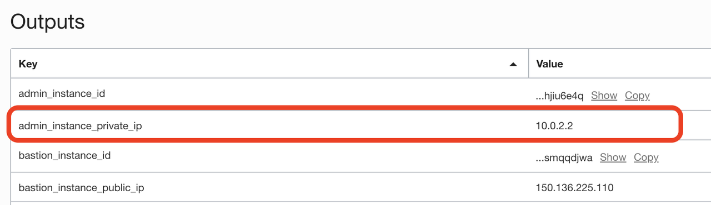
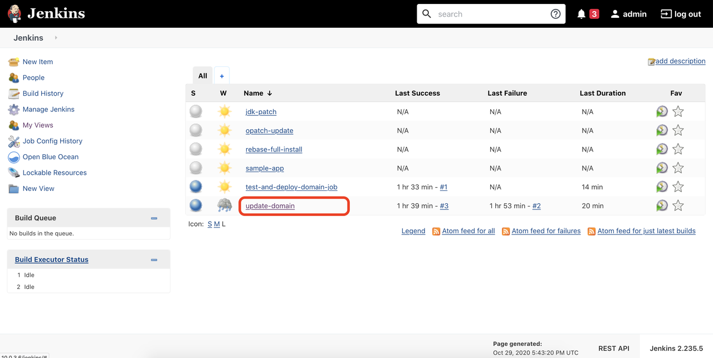
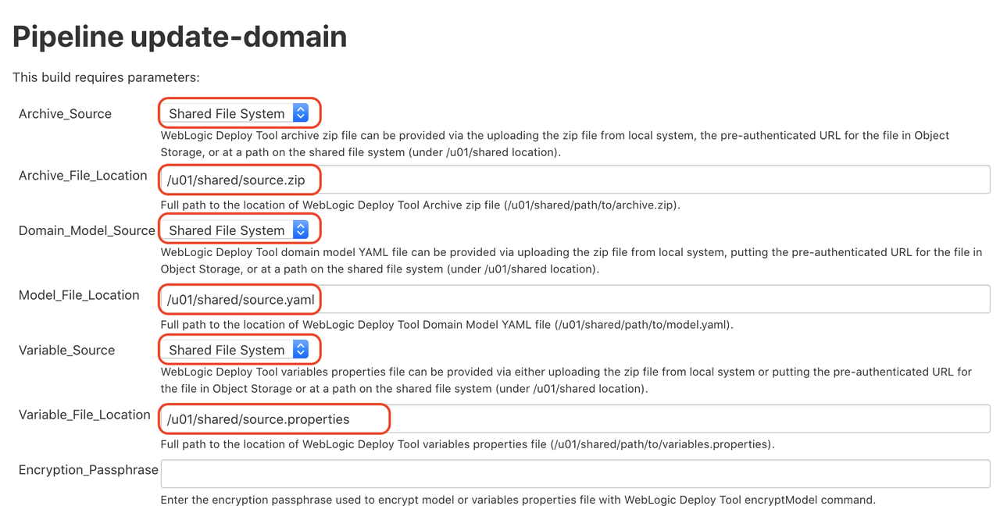
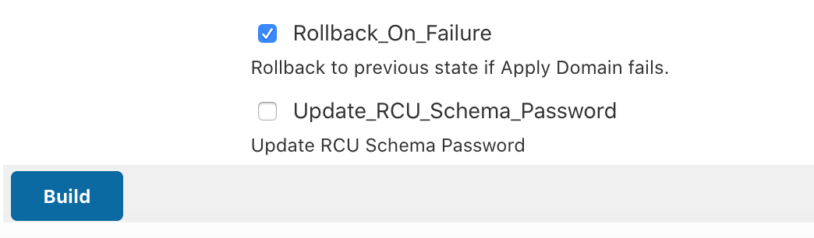
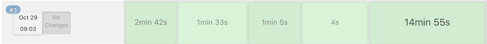
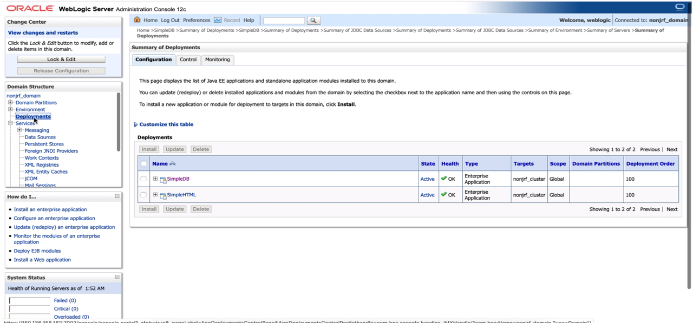
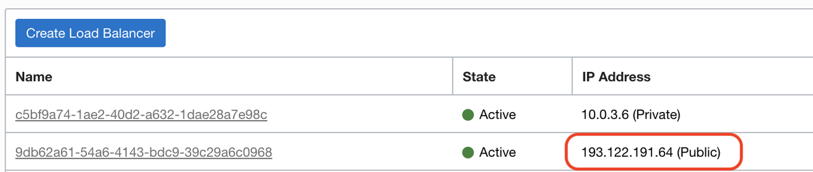

# Migrate the WebLogic Domain to Oracle WebLogic Server for OKE

## Introduction

Migrating a WebLogic domain is equivalent to re-deploying the applications and resources to a new domain and infrastructure.

We'll use WebLogic Deploy Tooling to migrate the domain from on-premises and re-deploy it on Oracle WebLogic Server (WLS) on Oracle Kubernetes Engine (OKE) via the Jenkins build pipeline to update the domain.

Estimated Completion Time: 15 minutes.

### About Products and Technologies

**WebLogic Deploy Tooling** is an open source tool found on Github at [https://github.com/oracle/weblogic-deploy-tooling](https://github.com/oracle/weblogic-deploy-tooling).

Migration with WebLogic Deploy Tooling (WDT) consists of 4 steps:

- Discover the source domain, and generate a **model** file of the topology, resources and applications, a **variable** file with required credentials, and an **archive** file with the application binaries.
- Edit the **model** file and **variable** file to target the new infrastructure on Oracle Cloud Infrastructure (OCI).
- Copy the files to shared file system on the OKE deployment.
- Run the update-domain pipeline with the model files.

### Objectives

- Install WebLogic Deploy Tooling on the source WebLogic domain.
- Discover the source domain.
- Edit the source domain model file.
- Edit the source domain property file.
- Copy the files over to the Jenkins shared file system.
- Update the target domain with Jenkins.
- Check migration was successful.

### Prerequisites

- Have set up the demo on-premises environment to use as the source domain to migrate.
- Have deployed a WebLogic on OCI domain using the Oracle Cloud Marketplace.
- Have migrated the application database from the source environment to OCI.

## Task 1: Installing WebLogic Deploy Tooling

### Using the docker on-premises environment:

1. If you were in the database container to perform the previous steps of database migration, exit the database container with:

    ```bash
    <copy>
    exit
    </copy>
    ```
    You should be back on your local computer shell prompt.

2. Get into the **WebLogic** docker container with the following command:

    ```bash
    <copy>
    docker exec -it weblogic-to-oci_wls_admin_1 /bin/bash
    </copy>
    ```

3. Run the `install_wdt.sh` script:

    ```bash
    <copy>
    cd ~/wdt
    ./install_wdt.sh
    </copy>
    ```

    This will install WebLogic Deploy Tooling locally in a folder `weblogic-deploy`.

### Using the demo workshop marketplace image

You should already be in the on-premises environment logged in as the `oracle` user.

Run the `install_wdt.sh` script:

```bash
<copy>
cd ~/wdt
./install_wdt.sh
</copy>
```

This will install WebLogic Deploy Tooling locally in a folder `weblogic-deploy`.

## Task 2: Discover the On-Premises Domain

The `discover_domain.sh` script wraps the **WebLogic Deploy Tooling** `discoverDomain` script to generate three files:

- `source.yaml`: the model file.
- `source.properties`: the variables file.
- `source.zip`: the archive file.

It also takes care of the manual extraction of applications that may be present under the `ORACLE_HOME`.

Applications found under `ORACLE_HOME` will have a path that includes `@@ORACLE_HOME@@` and **will not be included in the archive file**. They need to be extracted manually. The script takes care of this and injects those applications in the `source.zip` file while replacing the path in the `source.yaml` file.

Run the `discover_domain.sh` script:

```bash
<copy>
./discover_domain.sh
</copy>
```

The output of the `discover_domain.sh` script should look like:

```bash
rm: cannot remove ‘source.*’: No such file or directory
clean startup
Discovering the source domain...
set JVM version to minor  8
JDK version is 1.8.0_241-b07
JAVA_HOME = /u01/jdk
WLST_EXT_CLASSPATH = /home/oracle/wdt/weblogic-deploy/lib/weblogic-deploy-core.jar
CLASSPATH = /home/oracle/wdt/weblogic-deploy/lib/weblogic-deploy-core.jar
WLST_PROPERTIES = -Djava.util.logging.config.class=oracle.weblogic.deploy.logging.WLSDeployCustomizeLoggingConfig -Dcom.oracle.cie.script.throwException=true
/u01/oracle/oracle_common/common/bin/wlst.sh /home/oracle/wdt/weblogic-deploy/lib/python/discover.py -oracle_home /u01/oracle -domain_home /u01/oracle/user_projects/domains/base_domain -archive_file source.zip -model_file source.yaml -variable_file source.properties -domain_type JRF

Initializing WebLogic Scripting Tool (WLST) ...

Welcome to WebLogic Server Administration Scripting Shell

Type help() for help on available commands

####<May 28, 2020 6:00:28 PM> <INFO> <WebLogicDeployToolingVersion> <logVersionInfo> <WLSDPLY-01750> <The WebLogic Deploy Tooling discoverDomain version is 1.7.3:master.4f1ebfc:Apr 03, 2020 18:05 UTC>
####<May 28, 2020 6:00:28 PM> <INFO> <discover> <main> <WLSDPLY-06025> <Variable file was provided. Model password attributes will be replaced with tokens and corresponding values put into the variable file.>
####<May 28, 2020 6:00:33 PM> <INFO> <discover> <_get_domain_name> <WLSDPLY-06022> <Discover domain base_domain>
####<May 28, 2020 6:00:33 PM> <INFO> <TopologyDiscoverer> <discover> <WLSDPLY-06600> <Discovering domain model topology>
####<May 28, 2020 6:00:34 PM> <INFO> <TopologyDiscoverer> <_get_nm_properties> <WLSDPLY-06627> <Discovering NM Properties>
####<May 28, 2020 6:00:35 PM> <INFO> <Discoverer> <_get_additional_parameters> <WLSDPLY-06150> <Unable to determine if additional attributes are available for NMProperties at location /NMProperties : Unable to find a valid MBean Interface in the Class list array(java.lang.Class,[])  of the MBean instance com.oracle.cie.domain.nodemanager.NMPropertiesConfigProxyBase@4d96b968>
####<May 28, 2020 6:00:35 PM> <INFO> <TopologyDiscoverer> <get_clusters> <WLSDPLY-06601> <Discovering 1 clusters>
####<May 28, 2020 6:00:35 PM> <INFO> <TopologyDiscoverer> <get_clusters> <WLSDPLY-06602> <Adding Cluster cluster>
####<May 28, 2020 6:00:35 PM> <INFO> <TopologyDiscoverer> <get_servers> <WLSDPLY-06603> <Discovering 3 servers>
####<May 28, 2020 6:00:35 PM> <INFO> <TopologyDiscoverer> <get_servers> <WLSDPLY-06604> <Adding Server AdminServer>
####<May 28, 2020 6:00:37 PM> <INFO> <TopologyDiscoverer> <get_servers> <WLSDPLY-06604> <Adding Server server_0>
####<May 28, 2020 6:00:38 PM> <INFO> <TopologyDiscoverer> <get_servers> <WLSDPLY-06604> <Adding Server server_1>
####<May 28, 2020 6:00:38 PM> <INFO> <TopologyDiscoverer> <get_migratable_targets> <WLSDPLY-06607> <Discovering 2 Migratable Targets>
####<May 28, 2020 6:00:38 PM> <INFO> <TopologyDiscoverer> <get_migratable_targets> <WLSDPLY-06608> <Adding Migratable Target server_0 (migratable)>
####<May 28, 2020 6:00:39 PM> <INFO> <TopologyDiscoverer> <get_migratable_targets> <WLSDPLY-06608> <Adding Migratable Target server_1 (migratable)>
####<May 28, 2020 6:00:39 PM> <INFO> <TopologyDiscoverer> <get_unix_machines> <WLSDPLY-06609> <Discovering 1 Unix machines>
####<May 28, 2020 6:00:39 PM> <INFO> <TopologyDiscoverer> <get_unix_machines> <WLSDPLY-06610> <Adding Unix Machine machine_0>
####<May 28, 2020 6:00:39 PM> <INFO> <TopologyDiscoverer> <get_machines> <WLSDPLY-06611> <Discovering 0 machines>
####<May 28, 2020 6:00:39 PM> <INFO> <TopologyDiscoverer> <discover_security_configuration> <WLSDPLY-06622> <Adding Security Configuration>
####<May 28, 2020 6:00:39 PM> <INFO> <Discoverer> <_populate_model_parameters> <WLSDPLY-06153> <Attribute ProviderClassName for model folder at location /SecurityConfiguration/Realm/Adjudicator/DefaultAdjudicator is not in the lsa map and is not defined in the alias definitions>
####<May 28, 2020 6:00:40 PM> <INFO> <Discoverer> <_populate_model_parameters> <WLSDPLY-06153> <Attribute ProviderClassName for model folder at location /SecurityConfiguration/Realm/AuthenticationProvider/DefaultAuthenticator is not in the lsa map and is not defined in the alias definitions>
####<May 28, 2020 6:00:40 PM> <INFO> <Discoverer> <_populate_model_parameters> <WLSDPLY-06153> <Attribute ProviderClassName for model folder at location /SecurityConfiguration/Realm/AuthenticationProvider/DefaultIdentityAsserter is not in the lsa map and is not defined in the alias definitions>
####<May 28, 2020 6:00:40 PM> <INFO> <Discoverer> <_populate_model_parameters> <WLSDPLY-06153> <Attribute ProviderClassName for model folder at location /SecurityConfiguration/Realm/Authorizer/XACMLAuthorizer is not in the lsa map and is not defined in the alias definitions>
####<May 28, 2020 6:00:40 PM> <INFO> <Discoverer> <_populate_model_parameters> <WLSDPLY-06153> <Attribute ProviderClassName for model folder at location /SecurityConfiguration/Realm/CertPathProvider/WebLogicCertPathProvider is not in the lsa map and is not defined in the alias definitions>
####<May 28, 2020 6:00:40 PM> <INFO> <Discoverer> <_populate_model_parameters> <WLSDPLY-06153> <Attribute ProviderClassName for model folder at location /SecurityConfiguration/Realm/CredentialMapper/DefaultCredentialMapper is not in the lsa map and is not defined in the alias definitions>
####<May 28, 2020 6:00:40 PM> <INFO> <Discoverer> <_populate_model_parameters> <WLSDPLY-06153> <Attribute ProviderClassName for model folder at location /SecurityConfiguration/Realm/PasswordValidator/SystemPasswordValidator is not in the lsa map and is not defined in the alias definitions>
####<May 28, 2020 6:00:40 PM> <INFO> <Discoverer> <_populate_model_parameters> <WLSDPLY-06153> <Attribute ProviderClassName for model folder at location /SecurityConfiguration/Realm/RoleMapper/XACMLRoleMapper is not in the lsa map and is not defined in the alias definitions>
####<May 28, 2020 6:00:40 PM> <INFO> <TopologyDiscoverer> <get_embedded_ldap_configuration> <WLSDPLY-06639> <Skipping Embedded LDAP Server Configuration>
####<May 28, 2020 6:00:40 PM> <INFO> <ResourcesDiscoverer> <discover> <WLSDPLY-06300> <Discovering domain model resources>
####<May 28, 2020 6:00:40 PM> <INFO> <CommonResourcesDiscoverer> <get_datasources> <WLSDPLY-06340> <Discovering 1 JDBC System Resources>
####<May 28, 2020 6:00:40 PM> <INFO> <CommonResourcesDiscoverer> <get_datasources> <WLSDPLY-06341> <Adding JDBC System Resource JDBCConnection>
####<May 28, 2020 6:00:41 PM> <INFO> <DeploymentsDiscoverer> <discover> <WLSDPLY-06380> <Discovering domain model deployments>
####<May 28, 2020 6:00:41 PM> <INFO> <DeploymentsDiscoverer> <get_applications> <WLSDPLY-06391> <Discovering 2 Applications>
####<May 28, 2020 6:00:41 PM> <INFO> <DeploymentsDiscoverer> <get_applications> <WLSDPLY-06392> <Adding Application SimpleDB>
####<May 28, 2020 6:00:41 PM> <INFO> <DeploymentsDiscoverer> <add_application_to_archive> <WLSDPLY-06393> <Will not add application SimpleDB from Oracle installation directory to archive>
####<May 28, 2020 6:00:41 PM> <INFO> <DeploymentsDiscoverer> <get_applications> <WLSDPLY-06392> <Adding Application SimpleHTML>
####<May 28, 2020 6:00:41 PM> <INFO> <DeploymentsDiscoverer> <add_application_to_archive> <WLSDPLY-06393> <Will not add application SimpleHTML from Oracle installation directory to archive>
####<May 28, 2020 6:00:41 PM> <INFO> <MultiTenantDiscoverer> <discover> <WLSDPLY-06700> <Discover Multi-tenant>
####<May 28, 2020 6:00:41 PM> <INFO> <MultiTenantTopologyDiscoverer> <discover> <WLSDPLY-06709> <Discover Multi-tenant Topology>
####<May 28, 2020 6:00:41 PM> <INFO> <MultiTenantResourcesDiscoverer> <discover> <WLSDPLY-06707> <Discover Multi-tenant Resources>
####<May 28, 2020 6:00:42 PM> <INFO> <filter_helper> <apply_filters> <WLSDPLY-20017> <No filter configuration file /home/oracle/wdt/weblogic-deploy/lib/model_filters.json>
####<May 28, 2020 6:00:42 PM> <INFO> <variable_injector> <inject_variables_keyword_file> <WLSDPLY-19518> <Variables were inserted into the model and written to the variables file source.properties>
####<May 28, 2020 6:00:42 PM> <INFO> <Validator> <load_variables> <WLSDPLY-05004> <Performing variable validation on the source.properties variable file>
####<May 28, 2020 6:00:42 PM> <INFO> <Validator> <__validate_model_file> <WLSDPLY-05002> <Performing validation in TOOL mode for WebLogic Server version 12.2.1.4.0 and WLST OFFLINE mode>
####<May 28, 2020 6:00:42 PM> <INFO> <Validator> <__validate_model_file> <WLSDPLY-05003> <Performing model validation on the /home/oracle/wdt/source.yaml model file>
####<May 28, 2020 6:00:42 PM> <INFO> <Validator> <__validate_model_file> <WLSDPLY-05005> <Performing archive validation on the /home/oracle/wdt/source.zip archive file>
####<May 28, 2020 6:00:42 PM> <INFO> <Validator> <__validate_model_section> <WLSDPLY-05008> <Validating the domainInfo section of the model file>
####<May 28, 2020 6:00:42 PM> <INFO> <Validator> <__validate_model_section> <WLSDPLY-05008> <Validating the topology section of the model file>
####<May 28, 2020 6:00:43 PM> <INFO> <Validator> <__validate_model_section> <WLSDPLY-05008> <Validating the resources section of the model file>
####<May 28, 2020 6:00:43 PM> <INFO> <Validator> <__validate_model_section> <WLSDPLY-05008> <Validating the appDeployments section of the model file>
####<May 28, 2020 6:00:43 PM> <INFO> <Validator> <__validate_model_section> <WLSDPLY-05008> <Validating the kubernetes section of the model file>
####<May 28, 2020 6:00:43 PM> <INFO> <Validator> <__validate_model_section> <WLSDPLY-05009> <Model file /home/oracle/wdt/source.yaml does not contain a kubernetes section, validation of kubernetes was skipped.>

Issue Log for discoverDomain version 1.7.3 running WebLogic version 12.2.1.4.0 offline mode:

Total:       WARNING :     0    SEVERE :     0

discoverDomain.sh completed successfully (exit code = 0)
Some of the application files are located within the ORACLE_HOME and won't be extracted by WDT
Extracting those files and updating paths in the model file...
  adding: wlsdeploy/ (stored 0%)
  adding: wlsdeploy/applications/ (stored 0%)
  adding: wlsdeploy/applications/SimpleHTML.ear (deflated 72%)
  adding: wlsdeploy/applications/SimpleDB.ear (deflated 62%)
```

## Task 3: Edit the `source.yaml` File

The extracted `source.yaml` file looks like the following:

```yaml
domainInfo:
    AdminUserName: '@@PROP:AdminUserName@@'
    AdminPassword: '@@PROP:AdminPassword@@'
topology:
    Name: base_domain
    ProductionModeEnabled: true
    NMProperties:
        CrashRecoveryEnabled: true
        LogLevel: FINEST
        JavaHome: /u01/jdk
        ListenAddress: 0.0.0.0
        PropertiesVersion: 12.2.1.4.0
        SecureListener: false
        weblogic.StartScriptName: startWebLogic.sh
    Cluster:
        cluster:
            MulticastPort: 5555
            MulticastAddress: 237.0.0.101
            WeblogicPluginEnabled: true
            ClusterMessagingMode: multicast
    Server:
        AdminServer:
            Machine: machine_0
            ListenAddress: 0.0.0.0
        server_0:
            ListenPort: 7003
            Machine: machine_0
            Cluster: cluster
            ListenAddress: 0.0.0.0
            JTAMigratableTarget:
                Cluster: cluster
                UserPreferredServer: server_0
        server_1:
            ListenPort: 7005
            Machine: machine_0
            Cluster: cluster
            ListenAddress: 0.0.0.0
            JTAMigratableTarget:
                Cluster: cluster
                UserPreferredServer: server_1
    MigratableTarget:
        server_0 (migratable):
            Cluster: cluster
            MigrationPolicy: manual
            UserPreferredServer: server_0
            Notes: This is a system generated default migratable target for a server. Do not delete manually.
        server_1 (migratable):
            Cluster: cluster
            MigrationPolicy: manual
            UserPreferredServer: server_1
            Notes: This is a system generated default migratable target for a server. Do not delete manually.
    UnixMachine:
        machine_0:
            NodeManager:
                DebugEnabled: true
                NMType: Plain
                ListenAddress: 0.0.0.0
    SecurityConfiguration:
        NodeManagerPasswordEncrypted: '@@PROP:SecurityConfig.NodeManagerPasswordEncrypted@@'
        CredentialEncrypted: '@@PROP:SecurityConfig.CredentialEncrypted@@'
        Realm:
            myrealm:
                Adjudicator:
                    DefaultAdjudicator:
                        DefaultAdjudicator:
                AuthenticationProvider:
                    DefaultAuthenticator:
                        DefaultAuthenticator:
                    DefaultIdentityAsserter:
                        DefaultIdentityAsserter:
                            ActiveType: [ AuthenticatedUser, 'weblogic-jwt-token' ]
                Authorizer:
                    XACMLAuthorizer:
                        XACMLAuthorizer:
                            PolicyDeploymentEnabled: true
                CertPathProvider:
                    WebLogicCertPathProvider:
                        WebLogicCertPathProvider:
                CredentialMapper:
                    DefaultCredentialMapper:
                        DefaultCredentialMapper:
                PasswordValidator:
                    SystemPasswordValidator:
                        SystemPasswordValidator:
                RoleMapper:
                    XACMLRoleMapper:
                        XACMLRoleMapper:
resources:
    JDBCSystemResource:
        JDBCConnection:
            Target: cluster
            JdbcResource:
                JDBCConnectionPoolParams:
                    InitialCapacity: 0
                    TestTableName: SQL SELECT 1 FROM DUAL
                JDBCDataSourceParams:
                    GlobalTransactionsProtocol: TwoPhaseCommit
                    JNDIName: jdbc.JDBCConnectionDS
                JDBCDriverParams:
                    URL: 'jdbc:oracle:thin:@//oracledb:1521/PDB.us.oracle.com'
                    PasswordEncrypted: '@@PROP:JDBC.JDBCConnection.PasswordEncrypted@@'
                    DriverName: oracle.jdbc.xa.client.OracleXADataSource
                    Properties:
                        user:
                            Value: riders
appDeployments:
    Application:
        SimpleDB:
            SourcePath: 'wlsdeploy/applications/SimpleDB.ear'
            ModuleType: ear
            StagingMode: stage
            Target: cluster
        SimpleHTML:
            SourcePath: 'wlsdeploy/applications/SimpleHTML.ear'
            ModuleType: ear
            StagingMode: stage
            Target: cluster

```

1. Edit the `source.yaml`:

    ```bash
    <copy>
    nano source.yaml
    </copy>
    ```

    The `domainInfo` includes basic domain information which we will not change.

    The `topology` section includes the definition of the managed servers, admin server, machines and clusters. The domain is already provisioned on OCI so this will not change.

2.  Remove the entire `domainInfo` section and the `topology` section.

    The content now looks like:

    ```yaml
    resources:
        JDBCSystemResource:
            JDBCConnection:
                Target: cluster
                JdbcResource:
                    JDBCConnectionPoolParams:
                        InitialCapacity: 0
                        TestTableName: SQL SELECT 1 FROM DUAL
                    JDBCDataSourceParams:
                        GlobalTransactionsProtocol: TwoPhaseCommit
                        JNDIName: jdbc.JDBCConnectionDS
                    JDBCDriverParams:
                        URL: 'jdbc:oracle:thin:@//oracledb:1521/PDB.us.oracle.com'
                        PasswordEncrypted: '@@PROP:JDBC.JDBCConnection.PasswordEncrypted@@'
                        DriverName: oracle.jdbc.xa.client.OracleXADataSource
                        Properties:
                            user:
                                Value: riders
    appDeployments:
        Application:
            SimpleDB:
                SourcePath: 'wlsdeploy/applications/SimpleDB.ear'
                ModuleType: ear
                StagingMode: stage
                Target: cluster
            SimpleHTML:
                SourcePath: 'wlsdeploy/applications/SimpleHTML.ear'
                ModuleType: ear
                StagingMode: stage
                Target: cluster

    ```

3. Edit each of the 3 `Target` names for `resources` and `appDeployments` from `cluster` (the name of the cluster on-premises) to `nonjrf-cluster` (the name of the cluster on the OKE domain):

    * `resources->JDBCSystemResource->JDBCConnection->Target`
    * `appDeployments->Application->SimpleDB->Target`
    * `appDeployments->Application->SimpleHTML->Target`

    Note that because of the `-` sign, the Target name requires quotes.

    The content should look like:

    ```yaml
    resources:
        JDBCSystemResource:
            JDBCConnection:
                Target: 'nonjrf-cluster' # <---
                JdbcResource:
                    JDBCConnectionPoolParams:
                        InitialCapacity: 0
                        TestTableName: SQL SELECT 1 FROM DUAL
                    JDBCDataSourceParams:
                        GlobalTransactionsProtocol: TwoPhaseCommit
                        JNDIName: jdbc.JDBCConnectionDS
                    JDBCDriverParams:
                        URL: 'jdbc:oracle:thin:@//oracledb:1521/PDB.us.oracle.com'
                        PasswordEncrypted: '@@PROP:JDBC.JDBCConnection.PasswordEncrypted@@'
                        DriverName: oracle.jdbc.xa.client.OracleXADataSource
                        Properties:
                            user:
                                Value: riders
    appDeployments:
        Application:
            SimpleDB:
                SourcePath: 'wlsdeploy/applications/SimpleDB.ear'
                ModuleType: ear
                StagingMode: stage
                Target: 'nonjrf-cluster` # <---
            SimpleHTML:
                SourcePath: 'wlsdeploy/applications/SimpleHTML.ear'
                ModuleType: ear
                StagingMode: stage
                Target: 'nonjrf-cluster' # <---
    ```

  4. Finally, edit the `resources->JDBCSystemResource->JDBCConnection->JdbcResource->JDBCDriverParams->URL` to match the JDBC connection string of the database on OCI.

     The new JDBC connection string should be:
   
     ```
     <copy>
     jdbc:oracle:thin:@//db.nonjrfdbsubnet.nonjrfvcn.oraclevcn.com:1521/pdb.nonjrfdbsubnet.nonjrfvcn.oraclevcn.com
     </copy>
     ```
   
     This is the connection string gathered earlier but making sure the **service** name is changed to `pdb` (this is the name of the pdb where the `RIDERS.RIDERS` table resides, as needed by the **SimpleDB** application).
   
     The resulting `source.yaml` file should be like:
   
     ```yaml
     <copy>
     resources:
         JDBCSystemResource:
             JDBCConnection:
                 Target: 'nonjrf-cluster'
                 JdbcResource:
                     JDBCConnectionPoolParams:
                         InitialCapacity: 0
                         TestTableName: SQL SELECT 1 FROM DUAL
                     JDBCDataSourceParams:
                         GlobalTransactionsProtocol: TwoPhaseCommit
                         JNDIName: jdbc.JDBCConnectionDS
                     JDBCDriverParams:
                         URL: 'jdbc:oracle:thin:@//db.nonjrfdbsubnet.nonjrfvcn.oraclevcn.com:1521/pdb.nonjrfdbsubnet.nonjrfvcn.oraclevcn.com'
                         PasswordEncrypted: '@@PROP:JDBC.JDBCConnection.PasswordEncrypted@@'
                         DriverName: oracle.jdbc.xa.client.OracleXADataSource
                         Properties:
                             user:
                                 Value: riders
     appDeployments:
         Application:
             SimpleDB:
                 SourcePath: 'wlsdeploy/applications/SimpleDB.ear'
                 ModuleType: ear
                 StagingMode: stage
                 Target: 'nonjrf-cluster'
             SimpleHTML:
                 SourcePath: 'wlsdeploy/applications/SimpleHTML.ear'
                 ModuleType: ear
                 StagingMode: stage
                 Target: 'nonjrf-cluster'
     </copy>
     ```
   
   > **Important**: If when migrating a different domain the `StagingMode: stage` key was not present in the `Application` section, **make sure to add it** as shown so the applications are distributed and started on all managed servers.
   Also make sure to add single quotes to **Targets** even if the extracted model does not include them, as '-' characters cause issues in yaml.

5. Save the `source.yaml` file by typing `CTRL+x` then `y`.

## Task 4: Edit the `source.properties` File

  ```bash
  <copy>
  nano source.properties
  </copy>
  ```

  It looks like:

  ```yaml
  AdminPassword=
  AdminUserName=
  JDBC.JDBCConnection.PasswordEncrypted=
  SecurityConfig.CredentialEncrypted=
  SecurityConfig.NodeManagerPasswordEncrypted=
  ```

1. Delete all lines except for the `JDBC.JDBCConnection.PasswordEncrypted=` line, as these pertain to the `domainInfo` and `topology` sections we deleted from the `source.yaml`.

2. Enter the JDBC Connection password for the `RIDERS` user pdb.

    This can be found with
    ```bash
    <copy>
    cat /u01/app/oracle/gen_env.sh | grep DS_
    </copy>
    ```

   Although the name is `PasswordEncrypted`, enter the plaintext password and WebLogic will encrypt it when updating the domain.

   The resulting file should look like:

    ```yaml
    JDBC.JDBCConnection.PasswordEncrypted=<PDB_PASSWORD>
    ```

3. Save the file with `CTRL+x` and `y`.

## Task 5: Copy the Model Files over to the Shared File System

1. Export the `BASTION_IP` variable:

    ```bash
    <copy>
    export BASTION_IP=<Public IP of the Bastion instance>
    </copy>
    ```

2. Export the `RHOST` variable:

    ```bash
    <copy>
    export RHOST=<Private IP of the Admin node>
    </copy>
    ```

	> **Note:** this is NOT the private load balancer IP, this is the **Private IP of the admin node**, found in the **Outputs** of the deployment stack.

    

1. Run the following command to copy the files:

    ```bash
    <copy>
    scp -o ProxyCommand="ssh -W %h:%p opc@${BASTION_IP}" source.* opc@${RHOST}:/u01/shared/
    </copy>
    ```

    This will copy the files to the folder `/u01/shared/` in the shared file system, accessible to Jenkins.

## Task 6: Run the `update-domain` Build Job on Jenkins

1. Go to the Jenkins UI at `http://PRIVATE_LOAD_BALANCER_IP/jenkins` using the tunnel set up earlier.

2. Click the **Jenkins** top menu.

3. Click the *update-domain* pipeline.

    

4. Click the Build with Parameters menu on the left.

    

5. Select the WebLogic Domain to update (`nonjrf`).

6. Select **Shared Filesystem** for each of the file locations, and type the full path to each file as below.

    - Archive file

       ```
       <copy>
       /u01/shared/source.zip
       </copy>
       ```

    - Model file

       ```
       <copy>
       /u01/shared/source.yaml
       </copy>
       ```

    - Variables Properties file

       ```
       <copy>
       /u01/shared/source.properties
       </copy>
       ```

    

7. Run the job with the **Build** button.

    

8. Click the link to the job, then click Console Output for details on the job.

9. In case of failure, hover over the job step and check the logs for information about issues at each build step.

10. Wait until the job completes without failure in Jenkins.

    

## Task 7: Check the Application Deployed Properly

1. Go to the WebLogic Admin console (at `http://PRIVATE_LOAD_BALANCER_IP/nonjrf/console` under **Deployment** you should see the two applications listed.

   

2. In the OCI Console, click **Networking** then click **Load Balancers**.

3. Find the IP of the Public Load Balancer.

   

4. Go to `https://PUBLIC_LOAD_BALANCER_IP/SimpleDB` to see the SimpleDB application.

   

   You will be prompted once again with the self-sign certificate warning in Firefox.

## Acknowledgements

 - **Author** - Emmanuel Leroy, May 2020
 - **Last Updated By/Date** - Emmanuel Leroy, October 2021
