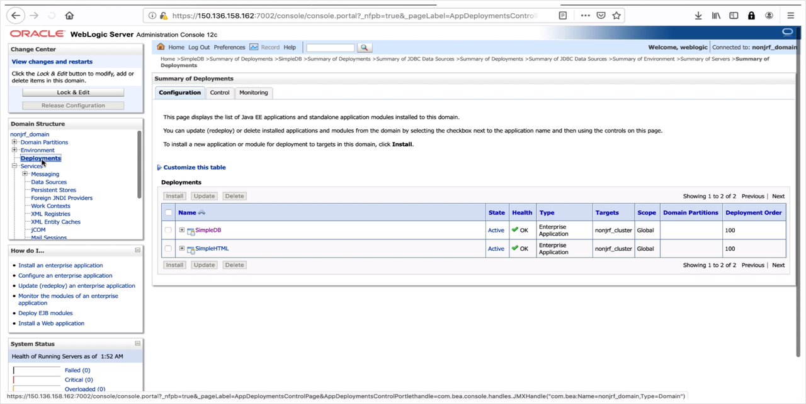

# Migrating the WebLogic Domain

## Introduction

Migrating a WebLogic domain is equivalent to re-deploying the applications and resources to a new domain and infrastructure.

We'll use WebLogic Scripting Tool to migrate the domain from on-premises and re-deploy it on OCI.

Estimated Lab Time: 15 minutes.

### About Product/Technologies

**WebLogic Scripting Tool** (WLST) is part of the WebLogic Server package, and uses the Python language to create, edit, update or delete objects in a domain.

Migration with WebLogic Scripting Tool consists of 3 steps:

- Move the deployment scripts and application files from the on-premises environment to the WebLogic on OCI infrastructure.
- Create an environment file to use as input to the scripts.
- Run the WLST script on the target environment to deploy the datasource and applications.

### Objectives

In this lab, you will:

- Move the application files and deployment WLST scripts to the target environment.
- Edit the environment file.
- Run the deployment scripts on the target.
- Check migration was successful.

### Prerequisites

To run this lab, you need to:

- Have set up the demo on-premises environment to use as the source domain to migrate.
- Have deployed a WebLogic on OCI domain using the marketplace.
- Have migrated the application database from the source environment to OCI.

## Task 1: Locate the Scripts and Application in the Source Environment

### Using the docker on-premises environment:

1. If you were in the database container to perform the previous steps of database migration, exit the database container with:

    ```bash
    <copy>
    exit
    </copy>
    ```
    You should be back on your local computer shell prompt.

2. Get into the **WebLogic** docker container with the following command:

    ```bash
    <copy>
    docker exec -it weblogic-to-oci_wls_admin_1 /bin/bash
    cd /u01/app/oracle
    </copy>
    ```

### Using the demo workshop marketplace image


You should already be in the on-premises environment logged in as the `oracle` user.

1. Get to the `/u01/app/oracle` folder

    ```bash
    <copy>
    cd /u01/app/oracle
    </copy>
    ```

## Task 2: Copy the Files Over

1. Package the files into a ZIP archive:

    ```bash
    <copy>
    zip wlst.zip SimpleDB.ear SimpleHTML.ear check.sh deploy_app.py deploy_datasource.py deploy.sh gen_env.sh oradatasource.tpl
    </copy>
    ```

2. Copy the files to the target admin server:

    Set the variables:

    ```bash
    <copy>
    export TARGET_WLS_SERVER=<IP of the WLS admin server>
    export BASTION_IP=<Public IP of the Bastion Instance>
    </copy>
    ```

    Then run:
    
    ```bash
    <copy>
    scp -o ProxyCommand="ssh opc@${BASTION_IP} -W %h:%p" wlst.zip opc@${TARGET_WLS_SERVER}:~/
    </copy>
    ```

    Get into the admin server with SSH:

    ```bash
    <copy>
    ssh -o ProxyCommand="ssh opc@${BASTION_IP} -W %h:%p" opc@${TARGET_WLS_SERVER}
    </copy>
    ```

3. Change file ownership and move to the oracle home:

    ```bash
    <copy>
    sudo chown oracle:oracle wlst.zip
    sudo mv wlst.zip /home/oracle
    sudo su - oracle
    </copy>
    ```

4. Unzip the files onto the `u01/app/oracle/` folder:

    ```bash
    <copy>
    unzip wlst.zip -d /u01/app/oracle/
    </copy>
    ```

5. Get into the `/u01/app/oracle` folder:

    ```bash
    <copy>
    cd /u01/app/oracle/
    </copy>
    ```

## Task 3: Edit the `gen_env.sh` File

The `gen_env.sh` files calls the metadata endpoint to populate some of required field automatically, but it doesn't know about the database and data source, which we will need to populate manually.

The `gen_env.sh` script looks like: 

```bash
# Copyright (c) 2014-2020 Oracle and/or its affiliates. All rights reserved.
#
#
#Licensed under the Universal Permissive License v 1.0 as shown at http://oss.oracle.com/licenses/upl.
#
# generate environment variables to generate the property file

export DB_HOST=
export DB_DOMAIN=

export DB_SID=RIDERS
export DB_PDB=PDB
export DB_PWD=****************
export DB_BUNDLE=basic

export DS_NAME=JDBCConnection
export DS_JNDI_NAME=jdbc.JDBCConnectionDS
export DS_USER=riders
export DS_PASSWORD=********************

export ADMIN_USERNAME=weblogic
export ADMIN_PASSWORD=welcome1

export DOMAIN_NAME=$(curl http://169.254.169.254/opc/v1/instance/metadata/wls_domain_name)
export ADMIN_NAME=$(curl http://169.254.169.254/opc/v1/instance/metadata/wls_admin_server_name)
export ADMIN_PORT=$(curl http://169.254.169.254/opc/v1/instance/metadata/wls_admin_port)

export CLUSTER_NAME=$(curl http://169.254.169.254/opc/v1/instance/metadata/wls_cluster_name)

export APP_PKG_LOCATION=$(pwd)

cat oradatasource.tpl | sed 's/"/\\\"/g;s/.*/echo "&"/e' > oradatasource.properties
```

It pulls the WebLogic information from the metadata endpoint v1 with calls to `curl http://169.254.169.254/opc/v1/instance/metadata/<keyword>`.

1. Edit the `gen_env.sh` script:

    ```bash
    <copy>
    nano gen_env.sh
    </copy>
    ```

    We need to populate the database variables:

    ```
    DB_HOST=<Private IP of the DB node>
    DB_DOMAIN=nonjrfdbsubnet.nonjrfvcn.oraclevcn.com <This is the part of the connection string without the CDB name>
    DB_PWD=<Your SYS password>
    ```

2. Save the file by typing `CTRL+x` then `y`.

3. Generate the `oradatasource.properties` file with:

    ```bash
    <copy>
    ./gen_env.sh
    </copy>
    ```

## Task 4: Run the Deployment Script

  ```bash
  <copy>
  ./deploy.sh
  </copy>
  ```

### You're done!

## Task 5: Check the Application Deployed Properly

1. Go to the WebLogic Admin console (at https://`ADMIN_SERVER_PUBLIC_IP`:7002/console if you deployed in a *Public Subnet*), or through the tunnel as you did earlier.

    Note: If you're using Chrome, you might encounter Self-signed certificate issues. We recommend using Firefox to test.

2. In Firefox you will see the self-certificate warning as below:

    

    Click **Advanced...** and then **Accept the Risk and Continue**

3. Log in with the Admin user `weblogic` and password: `welcome1`.

4. Go to `deployments`: you should see the 2 applications deployed, and in the **active** state.

  

5. Go to the SimpleDB application URL, which is the Load Balancer IP gathered previously in the **Outputs** of the WebLogic provisioning, with the route `/SimpleDB/` like:
https://*LOAD_BALANCER_IP*/SimpleDB/

    Making sure you use `https` as scheme and the proper case for `/SimpleDB`.

  

You may proceed to the next lab.

## Acknowledgements

 - **Author** - Emmanuel Leroy, May 2020
 - **Last Updated By/Date** - Emmanuel Leroy, October 2020
