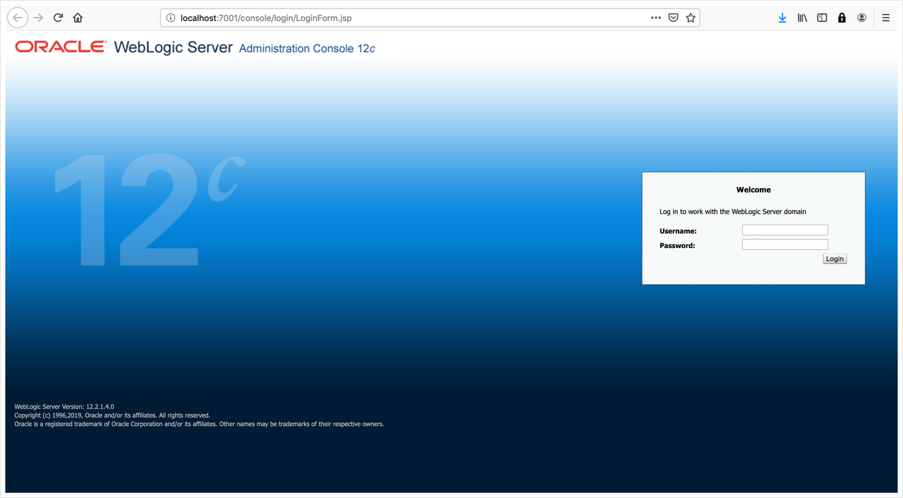
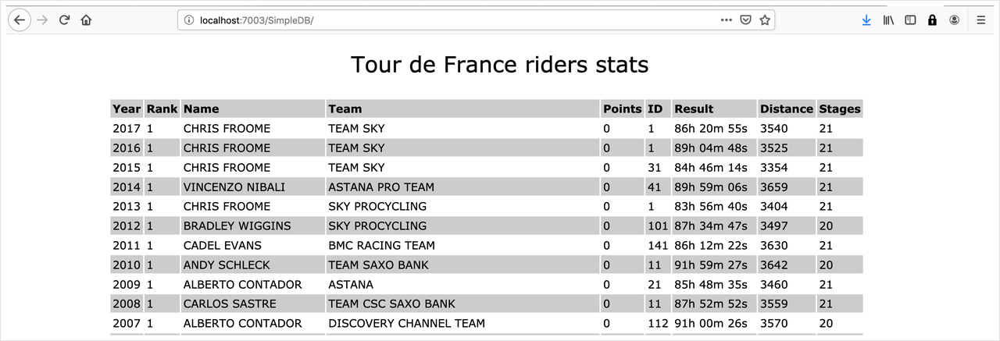

# Set up a local (on-premises) environment using Docker

## Introduction

We will walk you through setting up a local environment to simulate an established on-premises environment, using Docker on your local machine.

On completion, you will have a local environment running with an Oracle 12c database and Oracle WebLogic Server 12c with a domain containing two applications and a datasource.

Estimated Completion Time: 30 minutes.

### Objectives

- Get the Docker environment files.
- Start up the Docker-based on-premises demo environment.
- Check that the environment is running properly.
- Create an SSH key pair to communicate with the OCI services.


### Prerequisites

To run this tutorial, you will need:

- docker engine installed locally to run the on-premises environment.

  Get the docker engine with Docker Desktop at [https://docs.docker.com/get-docker/](https://docs.docker.com/get-docker/).

  You can also use alternative Docker distribution if you are not able to use Docker Desktop. Alternatives include:     
    - [colima](https://github.com/abiosoft/colima) for Max OS 
        ```bash
        <copy>
        brew install colima
        </copy>
        ```
    - Rancher Desktop for Max OS or Windows at [https://rancherdesktop.io/](https://rancherdesktop.io/)

  > **Note:** You need at least three CPUs and 6 GB of memory assigned to Docker to run this template.

- Docker-compose installed (on Linux, or using 3rd party docker, it needs to be installed separately, but it is installed automatically on Mac OS and Windows with Docker Desktop).

  [https://docs.docker.com/compose/install/](https://docs.docker.com/compose/install/)

- Oracle Container Registry Account, to download necessary Docker images.

  [https://container-registry.oracle.com/ords/f?p=113:10::::::](https://container-registry.oracle.com/ords/f?p=113:10::::::)

    Click Sign-in and Sign up for an account if you do not have one.


## Task 1: Get the Code

### **On Linux**

*Make sure you followed the installation instructions to set up Docker as root and:*

1. If you don't have an `oracle` user, create it an add it to a `oracle` group with:

    ```bash
    <copy>
    groupadd oracle
    useradd -g oracle oracle
    </copy>
    ```

2. Make sure you added the `oracle` user to the `docker` group as root with:

    ```bash
    <copy>
    sudo usermod -aG docker oracle
    </copy>
    ```

3. Switch to the `oracle` user with:

    ```bash
    <copy>
    sudo su - oracle
    </copy>
    ```

4. Get the code with:

    ```bash
    <copy>
    cd ~/
    wget https://objectstorage.us-ashburn-1.oraclecloud.com/p/5OJx9Uw1KIXVDKxCSvg5TjXdRiyxBoP5sJTk06ItQ87T4TY8WUzINwRt8U5EDQ3V/n/orasenatdpltintegration01/b/images/o/weblogic-to-oci.zip
    </copy>
    ```

5. Unzip the files with:

    ```bash
    <copy>
    unzip weblogic-to-oci.zip
    </copy>
    ```

You can also download the code here: [https://objectstorage.us-ashburn-1.oraclecloud.com/p/5OJx9Uw1KIXVDKxCSvg5TjXdRiyxBoP5sJTk06ItQ87T4TY8WUzINwRt8U5EDQ3V/n/orasenatdpltintegration01/b/images/o/weblogic-to-oci.zip](https://objectstorage.us-ashburn-1.oraclecloud.com/p/5OJx9Uw1KIXVDKxCSvg5TjXdRiyxBoP5sJTk06ItQ87T4TY8WUzINwRt8U5EDQ3V/n/orasenatdpltintegration01/b/images/o/weblogic-to-oci.zip).

### **On Mac OS X**

1. Get the code with:

    ```bash
    <copy>
    wget https://objectstorage.us-ashburn-1.oraclecloud.com/p/5OJx9Uw1KIXVDKxCSvg5TjXdRiyxBoP5sJTk06ItQ87T4TY8WUzINwRt8U5EDQ3V/n/orasenatdpltintegration01/b/images/o/weblogic-to-oci.zip
    </copy>
    ```

    If you do not have wget installed, you can download through your browser, or install wget with:
    ```
    <copy>
    brew install wget
    </copy>
    ```

2. Unzip the files with:

    ```bash
    <copy>
    unzip weblogic-to-oci.zip
    </copy>
    ```

You can also download the code here: [https://objectstorage.us-ashburn-1.oraclecloud.com/p/5OJx9Uw1KIXVDKxCSvg5TjXdRiyxBoP5sJTk06ItQ87T4TY8WUzINwRt8U5EDQ3V/n/orasenatdpltintegration01/b/images/o/weblogic-to-oci.zip](https://objectstorage.us-ashburn-1.oraclecloud.com/p/5OJx9Uw1KIXVDKxCSvg5TjXdRiyxBoP5sJTk06ItQ87T4TY8WUzINwRt8U5EDQ3V/n/orasenatdpltintegration01/b/images/o/weblogic-to-oci.zip).

### **On Windows**

1. Download the code here: [https://objectstorage.us-ashburn-1.oraclecloud.com/p/5OJx9Uw1KIXVDKxCSvg5TjXdRiyxBoP5sJTk06ItQ87T4TY8WUzINwRt8U5EDQ3V/n/orasenatdpltintegration01/b/images/o/weblogic-to-oci.zip](https://objectstorage.us-ashburn-1.oraclecloud.com/p/5OJx9Uw1KIXVDKxCSvg5TjXdRiyxBoP5sJTk06ItQ87T4TY8WUzINwRt8U5EDQ3V/n/orasenatdpltintegration01/b/images/o/weblogic-to-oci.zip).

2. Unzip the file with your preferred tool.

3. Open a terminal and get into the unzipped folder.

## Task 2: Agree to the Terms of the Private Docker Images

This repository makes use of Oracle docker images which are licensed and need to be pulled from Oracle Container Registry after acknowledging the terms of the license.

1. Sign in to Oracle Container Registry and go to the Weblogic image area at: [https://container-registry.oracle.com](https://container-registry.oracle.com)</a>.

    - Select a Language.
    - Scroll down to Accept the terms of license.

2. Search for the **Oracle Database** page, select **Enterprise** and accept the license terms.

    - Select a Language.
    - Scroll down to Accept the terms of license.

3. Search for the **Instant Client** page and accept the license terms for the SQL Plus client.

    - Select a Language.
    - Scroll down to Accept the terms of license.

4. Login to docker, providing your oracle container registry username and password:

    ```bash
    <copy>
    docker login container-registry.oracle.com
    </copy>
    ```

## Task 3: Start the Local Environment

Start up the local environment stack that will simulate our on-premises environment.

1. Make sure you are using the `oracle` user and run:

    ```
    <copy>
    cd weblogic-to-oci
    docker-compose build --no-cache
    docker-compose up -d
    </copy>
    ```

    This step can take several minutes because some images need to be built.

2. On Linux or Windows, Docker permission may cause issues so run:

    ```bash
    <copy>
    docker exec -it --user=root weblogic-to-oci-oracledb-1 /bin/chown 54321:54321 /home/oracle/.ssh
    </copy>
    ```

### Troubleshooting

If you get an error message like the following even though you are logged in, it usually means you have not accepted the *Terms and Condition* for the specific image.

```
pull access denied for container-registry.oracle.com/database/instantclient, repository does not exist or may require 'docker login': denied: requested access to the resource is denied
```

Go to the appropriate registry and image page, and go through the acknowledgement steps.

## Task 4:  Check the Local Environment

**It may take up to 10 minutes for the domain to be up and running**.

The weblogic container waits for the database to be ready, and the schemas to be created. Be patient.

1. Check that the WebLogic console is available at [http://localhost:7001/console](http://localhost:7001/console) and the WebLogic admin user is `weblogic` with password `welcome1`.

2. To check status of the initialization, you can check if the `weblogic-to-oci-oracledbinit-1` container has finished running by running:

    ```
    <copy>
    docker ps
    </copy>
    ```
    The following output shows the init container has terminated and the system should be ready:
    ```
    CONTAINER ID        IMAGE                      COMMAND                  CREATED             STATUS                PORTS                                                                          NAMES
    bf43e3bd5a78        weblogic-to-oci-oracledb    "/bin/sh -c '/bin/ba…"   7 days ago          Up 7 days (healthy)   127.0.0.1:1521->1521/tcp, 127.0.0.1:5000->5000/tcp, 5500/tcp                   weblogic-to-oci-oracledb-1
    38bcbb1555b8        weblogic-to-oci-wls-admin   "/u01/oracle/startNM…"   7 days ago          Up 7 days             127.0.0.1:7001->7001/tcp, 127.0.0.1:7003->7003/tcp, 127.0.0.1:7005->7005/tcp   weblogic-to-oci-wls-admin-1
    ```

    If you see a container called `weblogic-to-oci-oracledbinit`, this means the initialization is still ongoing.

3. To troubleshoot problems in the set up, check the logs in the docker containers with:

    ```bash
    <copy>
    docker logs -f weblogic-to-oci-wls_admin-1
    </copy>
    ```
    or
    ```bash
    <copy>
    docker logs -f weblogic-to-oci-oracledb-1
    </copy>
    ```

    Before proceeding, make sure the local environment has been deployed properly and is running.

    

    The **SimpleDB** application should be running at [http://localhost:7003/SimpleDB/](http://localhost:7003/SimpleDB/) or [http://localhost:7005/SimpleDB/](http://localhost:7005/SimpleDB/).

    It shows statistics of riders of the Tour de France stored in the database, and looks like this:

    

## Task 5: Create an SSH key

We'll need an SSH key pair to communicate with the WebLogic servers and the database on OCI. The public key will need to be provided when provisioning those resources.

Since we'll be running all our commands from docker containers, a folder has been mounted on the `~/.ssh/` folder inside both containers, so that it is shared and also accessible from the outside.

We'll create an SSH key pair in this folder.

1. Get inside the Oracle database container:

    ```bash
    <copy>
    docker exec -it weblogic-to-oci-oracledb-1 /bin/bash
    </copy>
    ```

2. Create the SSH key pair:

    ```bash
    <copy>
    ssh-keygen
    </copy>
    ```
    Press `Enter` (default) for all the prompts.

3. You should find two files `id_rsa` and `id_rsa.pub` inside the folder `./weblogic-to-oci/ssh/` on your local machine, and under `~/.ssh/` inside the containers.

    `id_rsa` is the private key, which should never be shared, and will be required to connect to any OCI resource provisioned with the corresponding public key `id_rsa.pub`.

    Note this key will be the default SSH key from within either docker container used for the on-premises environment. If you wanted to SSH to the OCI resources from outside the container, you would need to supply the private key as the identity file in the ssh command, with the `-i <path-to-id_rsa>/id_rsa`.

    > **Note:** This is only to be done once. If you run it again, a new key will overwrite the previous one and you will lose access to any resource provisioned with that key.

    > **Note:** If you're using a firewall and your instance is not local, make sure the ports for WebLogic (7001-7005) are open to be able to test the environment.

## Acknowledgements

 - **Author** - Emmanuel Leroy, May 2020
 - **Last Updated By/Date** - Emmanuel Leroy, March 2023
