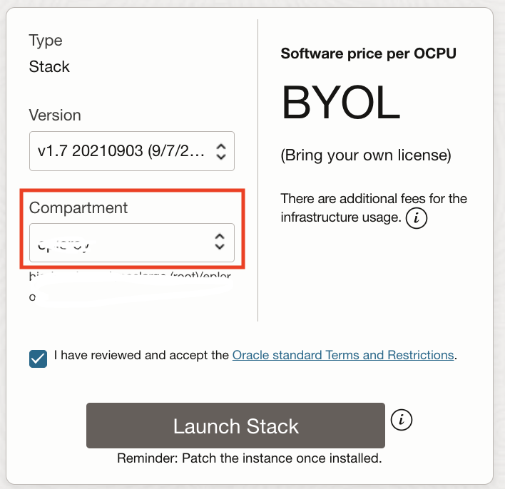
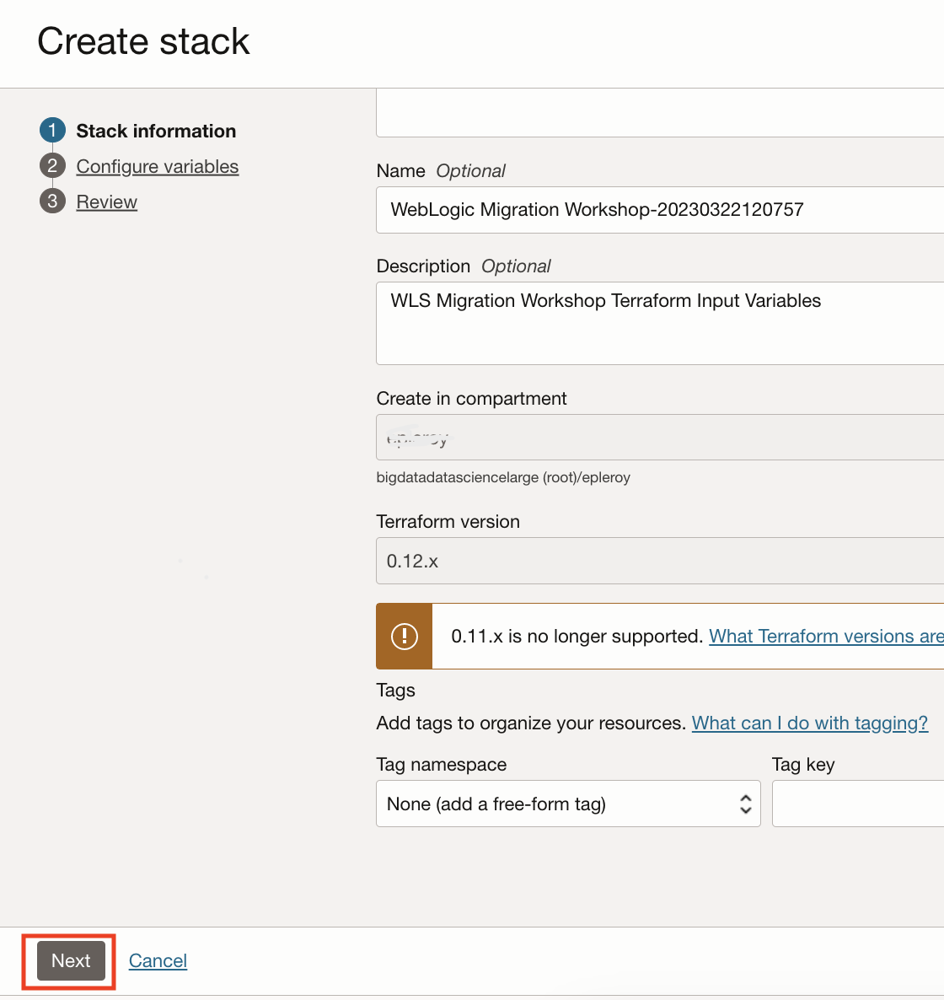
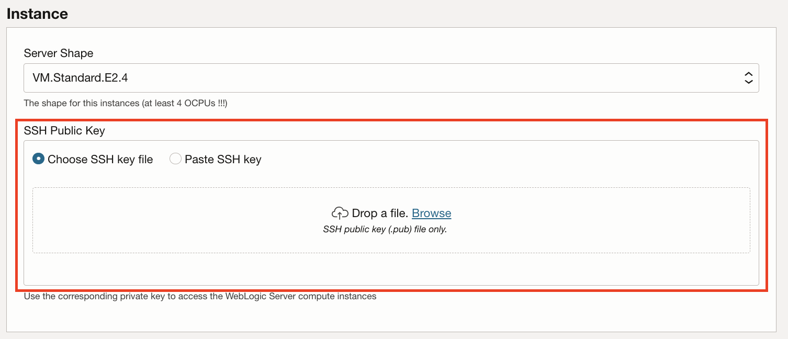
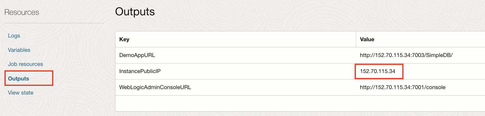

# Set up an on-premises environment using the workshop image

## Introduction

We will walk you through setting up an environment to simulate an established on-premises environment, using a Compute instance on OCI deployed through the marketplace.

On completion, you will have a simulated on-premises environment running with an Oracle 12c database and WebLogic Server 12c with a domain containing 2 applications and a datasource.

Estimated Completion Time: 15 minutes.

### Objectives

- Launch a demo marketplace image.
- Check that the services are up and running.
- Log into the instance.
- Create a SSH key pair.

### Prerequisites

- A compute instance with 4 OCPUs available to run the image.

## Task 1: Launch the Workshop Marketplace Stack

1. Navigate to [Workshop Environment Marketplace Stack](https://cloudmarketplace.oracle.com/marketplace/listing/82173888).

2. Click **Get App**.

   

3. Sign in to your Oracle Cloud Infrastructure account.

   

4. Choose a compartment.

   

5. Accept the Terms and Conditions and click **Launch**.

   

6. Click **Next**.

   

7. Paste your **SSH public key**.

   To connect to the WebLogic servers via SSH, you need to provide a public key the server will use to identify your computer.

   

8. Click **Next** and then **Create**.

   

   It will take about 1 to 2 minutes to create the stack.

9. When the job finishes, you can find the Public IP address of the instance at the bottom of the logs, or in the **Output** area. Make a note of this information.

   

## Task 2:  Check the Local Environment

It will take another 4 to 5 minutes for all the services to come online.

1. The console will be available at `http://PUBLIC-IP:7001/console` (replace `PUBLIC_IP` with the Compute instance public IP) and the WebLogic admin user is `weblogic` with password `welcome1`.

   

2. The **SimpleDB** application will be running at `http://PUBLIC-IP:7003/SimpleDB/` (substitute `PUBLIC-IP` with the public IP of the instance). It may take a minute or 2 after the admin console is up for the SimpleDB app to be running.

3. It shows statistics of riders of the Tour de France stored in the database, and looks like this:

   

## Task 3: Log in to the On-Premises Environment

Most of the work will be done from the simulated on-premises environment deployed in the compute instance on OCI.

1. To log into the instance, use:

    ```bash
    <copy>
    ssh opc@<public-ip>
    </copy>
    ```

    Replace the `<public-ip>` with the IP provided in the output of the provisioning job.

2. You will be prompted to add this IP to the list of known hosts. Enter `yes`.

## Task 4: Create an SSH Key

We'll need a SSH key pair to communicate with the WebLogic servers and the database on OCI. The public key will need to be provided when provisioning those resources.

We'll create a SSH key pair in the default folder.

1. Once on the compute instance on OCI, switch to the oracle user:

    ```bash
    <copy>
    sudo su - oracle
    </copy>
    ```

2. Create the SSH keypair:

    ```bash
    <copy>
    ssh-keygen
    </copy>
    ```
	
    Press `Enter` (default) for all the prompts.

3. You will find two files `id_rsa` and `id_rsa.pub` inside the folder `~/.ssh/` or `/home/oracle/.ssh/`.

    `id_rsa` is the private key, which should never be shared, and will be required to connect to any OCI resource provisioned with the corresponding public key `id_rsa.pub`.

    This key will be the default SSH key from the instance used for the on-premises environment.

    > **Note:** This is only to be done once. If you run it again, a new key will overwrite the previous one and you will lose access to any resource provisioned with that key.

## Acknowledgements

 - **Author** - Emmanuel Leroy, May 2020
 - **Last Updated By/Date** - Emmanuel Leroy, March 2023
