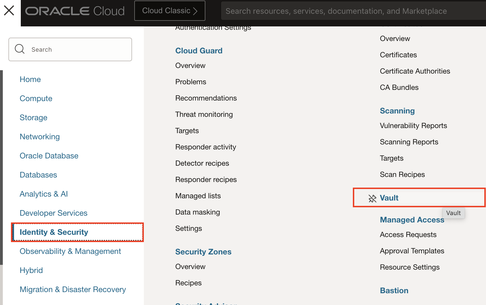

# Prepare the OCI account

## Introduction

We will prepare the OCI environment to provision WebLogic Server for Oracle Cloud Infrastructure (OCI) from the Oracle Cloud Marketplace.

Estimated Completion Time: 5 minutes.

### Objectives

- Create a Vault.
- Create a Key.
- Create a Secret to hold the WebLogic Admin password.
- Create a Secret to hold the OCI Docker Image Registry Auth Token.
- Copy the Secret OCIDs to use during the provisioning stage.
- Check policies and create a Dynamic Group and associated policies if needed.

### Prerequisites

- An OCI account with a compartment created.

## Task 1: Create a vault

1. On the **Security** menu, click **Vault**.

   

2. Make sure you are in the compartment where you want to deploy WebLogic.

3. Click **Create Vault**.

   

4. Name the vault `WebLogic Vault` or a name of your choosing. Make sure the `private` option is **not checked** and click **Create Vault**.

   

## Task 2: Create a Key in the Vault

1. Once the vault is provisioned, select the vault.

   

2. Click **Create Key**.

   

3. Name the key `WebLogicKey` or a name of your choosing and click **Create Key**.

   

## Task 3: Create an Auth Token to Access OCI Registry

1. On the **User** menu, click **User Settings** then click **Auth Tokens** on the left menu.

   

2. Click **Generate Token**.

3. Give it a name like **OCIR**.

4. Click **Generate Token**.

5. Copy the **output** of the token to clipboard.

## Task 4: Create a Secret with the Auth Token

1. On the **Security** menu, click **Vault** then **Secrets**.

2. Click **Create Secret**.

3. Name it **OCIR**.

4. Use the *same key* (`WebLogicKey`).

5. Paste the **Auth Token** created and copied to clipboard earlier as the **Secret Contents**.

6. Click **Create Secret**.

7. Click the **OCIR** secret you created and make a note of the **OCID** of the secret for later use.

## Task 5: Check Policies Needed to Deploy and Create Dynamic Group if Needed.

If you don't have the following policy for your group:

```
<copy>
Allow group MyGroup to manage dynamic-groups in tenancy
Allow group MyGroup to manage policies in tenancy
</copy>
```

You will need to create a Dynamic Group and associated Policies:

1. From the navigation menu, select Identity & Security. Under the Identity group, click Compartments.

2. Copy the OCID for the compartment that you plan to use for the Oracle WebLogic Server compute instances.
   
   If you use another compartment just for network resources, copy also the OCID of the network compartment.

3. Click Dynamic Groups.

4. Click Create Dynamic Group.

5. Enter a Name and Description. In the policies below we assume the name is *MyInstancesPrincipalGroup*

6. For Rule 1, create a rule that includes all instances in the selected compartment in this group.

   ```
   <copy>
   ALL {instance.compartment.id = 'WLS_Compartment_OCID'}
   </copy>
   ```

   Provide the OCID for the compartment you copied previously.

7. Click Create Dynamic Group.

8. Create the policy for the dynamic group

   ```
   <copy>
   Allow dynamic-group MyInstancesPrincipalGroup to manage all-resources in compartment MyCompartment
   Allow service oke to read app-catalog-listing in compartment MyCompartment
   Allow dynamic-group MyInstancesPrincipalGroup to read secret-bundles in compartment VaultCompartment where target.secret.id = '<OCID for OCIR token secret>'
   Allow dynamic-group MyInstancesPrincipalGroup to inspect subnets in NetworkCompartment
   Allow dynamic-group MyInstancesPrincipalGroup to use dynamic-groups in MyCompartment
   </copy>
   ```

9. To use the OS Management Service, you can add the following policies as well:

   ```
   <copy>
   Allow dynamic-group MyInstancesPrincipalGroup to use osms-managed-instances in compartment MyCompartment
   Allow dynamic-group MyInstancesPrincipalGroup to read instance-family in compartment MyCompartment
   </copy>
   ```

## Acknowledgements

 - **Author** - Emmanuel Leroy, May 2020
 - **Last Updated By/Date** - Emmanuel Leroy, October 2021
