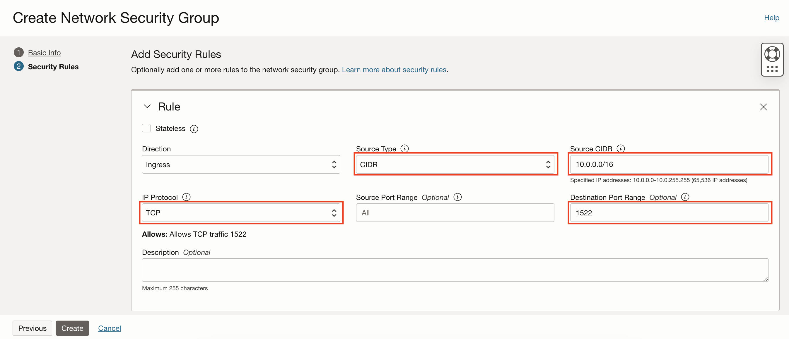
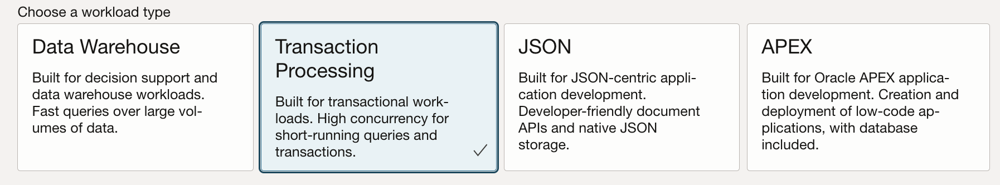
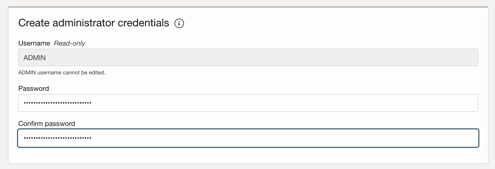
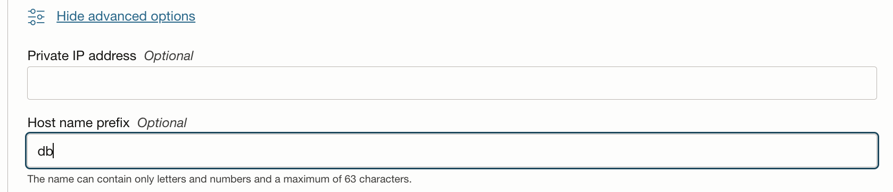

# Provision the Application Autonomous Database on OCI

## Introduction

We will guide you through provisioning an application database using Oracle Autonomous Transaction Processing database service.

Estimated Completion Time: 30 to 35 minutes including 25 to 30 minutes of provisioning time.

### Objectives

- Create a Network Security Group with proper ports open.
- Create a private subnet for the application database.
- Provision the application database.

## Task 1: Create a Network Security Group (NSG) for the Database Subnet

Before we can provision the application database, we need to provision a **private subnet** for the **Database System** with appropriate **Network Security Group** to open up the required port 1522 for the database.

In this section we will create a Network Security Group for the WebLogic subnet to be able to reach the database subnet on port 1522 (the Oracle Autonomous Database default port).

1. In the **Networking** menu go to **Virtual Cloud Network** in the compartment where WebLogic was provisioned.

  

2. Click the VCN that was created by the stack, which would be called `nonjrf-wls` if you used the same naming conventions.

  

3. Click **Network Security Groups** on the left-side menu.

  

4. Click **Create Network Security Group**.

  

5. **Name** the security group `ATP-NSG` and the compartment where the WLS stack was deployed, then click **Next**.

  

6. Select:

    - **Source Type**: **CIDR**.
    - **Source CIDR**: **10.0.0.0/16**.
    - **IP Protocol**: **TCP**.
    - **Destination Port Range**: **1522**.

  

7. Click **Create**.

## Task 2: Create the Database Subnet

1. Click **Subnets** on the left-side menu.

  

2. Click **Create Subnet**.

  

3. **Name** the subnet `nonjrf-db-subnet`.

  

4. Keep the defaults for the **Subnet Type** and enter a CIDR block of `10.0.7.0/24`.

  

5. **Select** the `nonjrf-sg-routetable` for the **Routing Table**.

  

6. Select **Private Subnet**.

  

7. Keep the defaults for the DNS resolution and label and select `Default DHCP Options for nonjrf-wls` for **DHCP Options**.

  

8. **Select** the `Default Security List for nonjrf-wls` for the **Security List**.

  

9. Click **Create Subnet**.

  

## Task 3: Provision the Autonomous Database System

1. In the **Oracle Database** menu, select **Autonomous Transaction Processing**.

  

2. Click **Create Autonomous Database**.

  

3. Make sure you are in the **Compartment** where you created the DB subnet, and name your **Database System** **WLSATPDB** or a name of your choice.

  

4. Select **Workload Type** to be **Transaction Processing**.

  

5. Keep the defaults for **Deployment Type** to **Shared Infrastructure**.

  

6. For this lab, you can use the Always Free option, but this is not recommended for production. If you want to use that option, click the **Show Only Always Free Options**, otherwise keep the defaults for **Database Version**, **OCPU count**, **Storage** and **Auto Scaling** or adjust to your needs.

  

7. Enter and confirm the **Admin Database password** :

    ```
    <copy>
    <Your password with 9 to 30 characters: 2 upper, 2 lower, 2 numbers, 2 special characters (#_-)>
    </copy>
    ```

  

8. Choose **Network Access** to be **Virtual Cloud Network**.

  

9. Select the **Virtual Cloud Network** as **nonjrf-wls**.

  

9. Select the **Subnet** as **nonjrf-db-subnet**.

  

10. Click **Show Advanced Settings**

10. Select the **db hostname** as **db**.

  

9. Select the **Network Security Group** created earlier **ATP-NSG**.

  

11. Click **Create Autonomous Database**.

  

To save some time, you can proceed to starting the database migration tutorial while the database is provisioning if you wish, however you will need the database fully provisioned and you will need to gather the database information before you can finish the migration.

## Acknowledgements

 - **Author** - Emmanuel Leroy, May 2020
 - **Last Updated By/Date** - Emmanuel Leroy, October 2020
