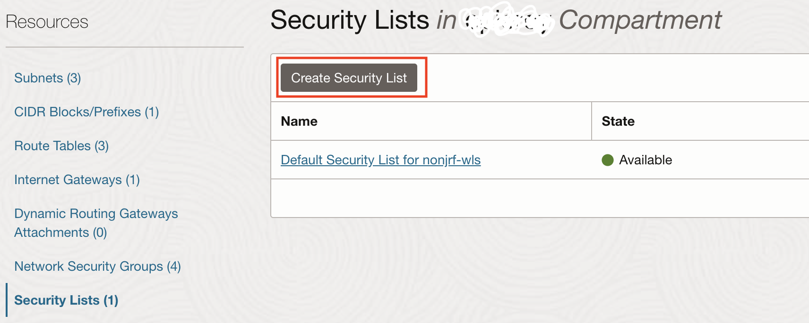
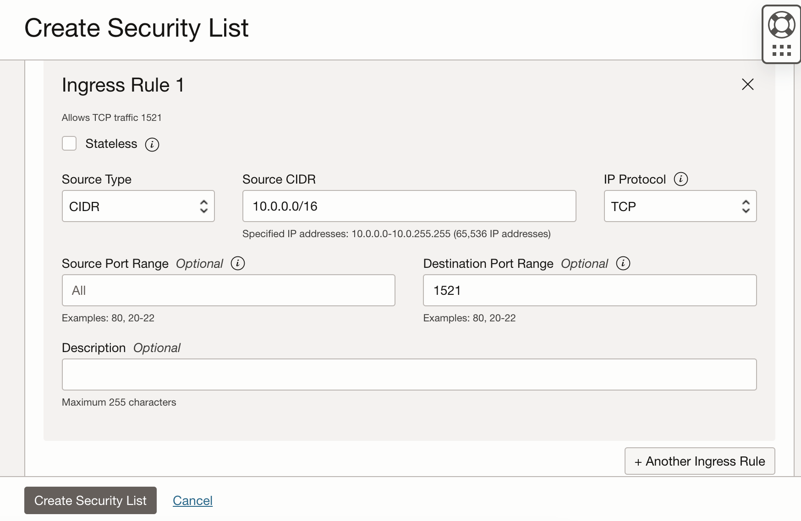

# Provision the Application Database on Oracle Cloud Infrastructure with Database as a Service

## Introduction

We will guide you through provisioning an application database.

Estimated Completion Time: 30 to 35 minutes including 25 to 30 minutes for provisioning time.

### Objectives

- Create a security list with proper ports open.
- Create a private subnet for the application database.
- Provision the application database as a database VM.

## Task 1: Create a Security List for the Database Subnet

Before we can provision the application database, we need to provision a **private subnet** for the **Database System** with appropriate **Security Lists** to open up the required ports:

- Port 1521 for the database.
- Port 22 for SSH.

In this section we will create a security list for the WebLogic subnet to be able to reach the database subnet on port 1521 (the Oracle database default port) and SSH port 22.

1. Go to **Networking -> Virtual Cloud Network** in the compartment where WebLogic was provisioned.

  

2. Click the VCN that was created by the stack, which would be called `nonjrf-wls` if you used the same naming conventions.

  

  You should find two subnets: a `nonjrf-lb-pubsubnet` and a `nonjrf-wls-subnet`.

3. Click **Create Security List**.

  

4. **Name** the security list `nonjrf-db-security-list`.

  

5. Click **Additional Ingress Rule**.

  

6. For **Source CIDR**, use the whole VCN CIDR `10.0.0.0/16` and for **Destination Port Range** enter **1521**.

  

7. Click **Additional Ingress Rule** and enter `0.0.0.0/0` for the **Source CIDR** and enter `22` for the **Destination Port Range** to authorize SSH from outside (through the bastion host).

  

8. Click **Create Security List**.

## Task 2: Create the Database Subnet

1. Click **Subnets** on the left-side menu.

  

2. Click **Create Subnet**.

  

3. **Name** the subnet `nonjrf-db-subnet`.

  

4. Keep the defaults for the **Subnet Type** and enter a CIDR block of `10.0.7.0/24`.

  

5. **Select** the `Default Routing Table for nonjrf-wls` for the **Routing Table**.

  

6. Select **Private Subnet**.

  

7. Keep the defaults for the DNS resolution and label and select `Default DHCP Options for nonjrf-wls` for **DHCP Options**.

  

8. **Select** the `nonjrf-db-security-list` created earlier for the **Security List**.

  

9. Click **Create Subnet**.

  

## Task 3: Provision the Database System

1. Go to **Database -> Bare Metal, VM and Exadata**.

  

2. Click **Create DB System**.

  

3. Make sure you are in the **Compartment** where you created the database subnet, and name your **Database System**.

  

4. Select an availability domain or keep the default, keep the default **Virtual Machine** and select a **Shape** that is available.

  

5. Keep the defaults for **Total node count** and **Database Edition**.

  

6. Select **Logical Volume Manager**.

  

7. Keep defaults for **Storage**.

  

8. **Upload** the **SSH public key** created earlier.

    The key created in the Docker container can be found in the `./weblogic-to-oci/ssh` folder.

    If using the marketplace image, just use the **Paste SSH Keys** and get the key  inside the on-premises environment with:

    ```
    <copy>
    cat ~/.ssh/id_rsa.pub
    </copy>
    ```

  

9. Keep the default **License Included**.

  

10. Select the **Virtual cloud network** `nonjrf-wls`, the **Client subnet** `nonjrf-db-subnet` and set a **Hostname prefix** of `db`.

  

11. Click **Next**.

12. Name the database `RIDERS` like the database on-premises (required for proper migration).

  

13. Keep the default database version 19c.

  

14. Name the **PDB** `pdb` as it is on premises.

  

15. Enter and confirm the **SYS Database password** as it is on-premises:

    ```
    <copy>
    <Your password with 9 to 30 characters: 2 upper, 2 lower, 2 numbers, 2 special characters (#_-)>
    </copy>
    ```

  

16. Keep the default of **Transaction Processing**, select **Workload type** and **Backup**, and click **Create DB System**.

  

  This will usually take up to 40 minutes to provision.

  

To save some time, you can proceed to Migrating the Application Database while the database is provisioning if you wish, however you will need the database fully provisioned and you will need to gather the database information before you can finish the migration.

## Acknowledgements

 - **Author** - Emmanuel Leroy, May 2020
 - **Last Updated By/Date** - Emmanuel Leroy, August 2020
