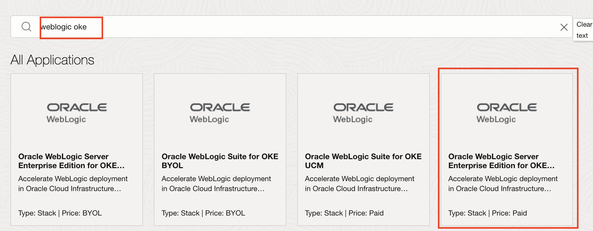
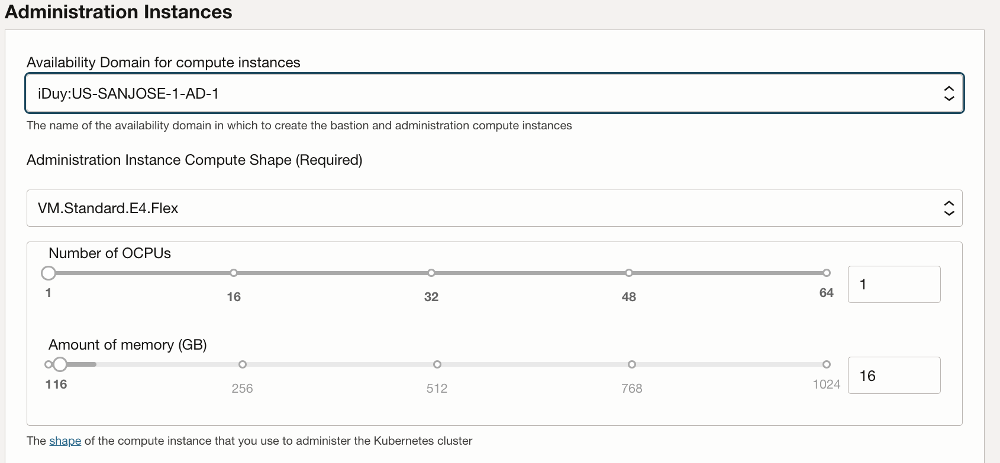
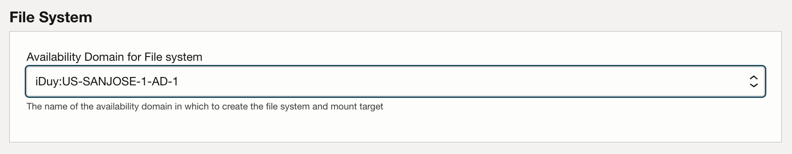
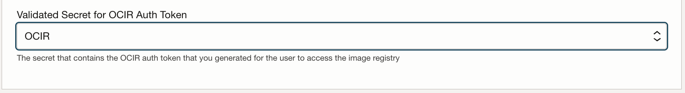
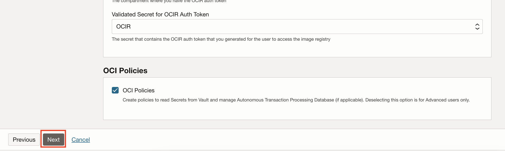

# Provision Oracle WebLogic Server on Oracle Kubernetes Engine

## Introduction

We will walk you through provisioning the WebLogic Infrastructure on Oracle Kubernetes Engine (OKE) by leveraging the OCI Cloud Marketplace.

Estimated Completion Time: 30 minutes.

### Objectives

- Provision Oracle WebLogic Server on OKE via the Oracle Cloud Marketplace offering.
- Gather information for further steps.

### Prerequisites

You need to have prepared the Oracle Cloud Infrastructure (OCI) tenancy with:

- A Vault.
- A Key.
- A Secret for the OCI Registry Auth Token.
- Either have proper policies to create Dynamic Groups or have manually created the Dynamic Group.

## Task 1: Provision the Stack Through the Marketplace

1. Go to **Solutions and Platforms**.

   

2. In the search input, type `weblogic oke` and click **WebLogic Enterprise Edition on OKE UCM**.

   

3. Make sure you are in the compartment that you want to use, use the default WebLogic version available, accept the license agreement and click **Launch the Stack**.

   

4. Name the stack and click **Next**.

   

5. Enter a **Resource Name Prefix**.

   It will be used to prefix the name of all the resources (domain, managed servers, admin server, cluster, machines and so on.).

   The next steps in this workshop assumes the resource name prefix is `nonjrf`, so it is highly recommended to use this name.

   

6. Provide an **SSH key**.

   To connect to the WebLogic servers via SSH, you need to provide a public key the server will use to identify your computer.

   Since the various commands will be ran from inside the on-premises environment (either the workshop compute instance or the local docker containers), you will need to provide the key generated in the on-premises environment.

   

7. To output the public key information, use the following command from inside the on-premises environment as the `oracle` user.

   ```
    <copy>
    cat ~/.ssh/id_rsa.pub
    </copy>
    ```
    Copy the output of the command (the whole multi-line output) and paste it in the form field for SSH key in the form.

    The output will look something like this:

    ```bash
    ssh-rsa AAAAB3NzaC1yc2EAAAADAQABAAABAQDlkF23qLyfimJ9Vp4D9psp7bDOB8JvtY/pfYzFxIA2E4v6or+XhvMW5RDhX9Ba54zQNNDLvwUhStdXKkiMXJtEQJarFn45pGy/lyUQKFJolAdHBrXJsg5XWn4DxCFeQUQe1szVfmwDLAktAS14r5g76h3CcA8Kk/cNVqevxVChyejuuOdtAMoriIC8uKV+535qPs/GMiu0zR9aW4w1VodL5eHnXjqdgp8Fr21dVUVQ6of+s/ws0zlQUwghrNguDUqlggzG2mpLBHExypxCrJYmsb05uYjjqVlC3YCatj4nJTIHKLCFiYVY/b8AFkqwXV9EYlja5bjTmunM847dcR8H oracle@ad753161734c
    ```

    > **Note:** Do not use the example above as the key: it is a different public key which is useless without the corresponding private key, and you will not be able to access your resources on OCI)

8. Under **Network**, select **Create New VCN** and keep the other defaults.

    

9. Under **Container Cluster (OKE) Configuration** select the **Non-Weblogic Node Pool Shape** from a shape available in your tenancy.

9. Similarly select the **Weblogic Node Pool Shape** from a shape available in your tenancy.

10. Under **Container Cluster (OKE) Administration Instances**, select an **Availability Domain** and shapes for the **Administration Instance Compute Shape** and **Bastion Instance Shape**.

    

11. Select an **Availability Domain** for the **File System**.

    

12. Under Registry (OCIR) enter your full **Username**, which you find under your **User icon**.

13. Select the secret for the **OCI Registry Auth Token**.

    

14. Keep **OCI Policies** checked **unless** you are not an admin and you created the Dynamic Group manually in the 'Prepare' step.

22. Click **Next** and then **Create**

    

23. The stack will get provisioned using the **Resource Manager**. This may take 7 to 15 minutes.

    

Once the stack is provisioned, you can find the information regarding the URL and IP of the WebLogic Admin server in the logs, or in the **Outputs** left-side menu.

## Task 2: Gather Deployment Information

Go to **Outputs** (or you can find the same information at the bottom of the logs).

You should see something like the following:


- Make a note of the **Admin Instance Private IP** for later use.

- Make a note of the Bastion Instance **Public IP address** for later use.

- Make a note of the **Kubernetes API Endpoints** for later use.

To access the UI consoles, you will need to create a tunnel through the bastion host to your local machine.

We'll need to set up a tunnel through the Bastion Instance, with a dynamic port to connect to the Admin Console and the Jenkins UI with the browser.

## Task 3: Set Up Connectivity

1. Extract the SSH key from the on-premises environment:

   In the *Docker* environment, the key pair (`id_rsa` and `id_rsa.pub`) is exported for you in the `weblogic-to-oci/ssh/` folder.

   If your used the marketplace demo image, you need to extract the key to your local machine.

   Since we only have SSH access with the `opc` user, the key first needs to be moved to the opc user home and then exported.

   In the on-premises VM, as the oracle user:

    ```bash
    <copy>
    sudo cp ~/.ssh/id_rsa /home/opc/
    </copy>
    ```

   Exit the oracle user shell, and exit the VM, by typing `exit` twice.

   On your local machine shell:

    ```bash
    <copy>
    mkdir ssh
    scp opc@<DEMO_ENV_IP>:~/id_rsa ./ssh/
    </copy>
    ```

   The key `id_rsa` will now be in your local folder.

2. Create a dynamic port tunnel through the Bastion Instance.

   On Linux or Mac OS, use the following command to create a tunnel from the WLS admin server to your local machine.

    ```bash
    <copy>
    ssh -i ./ssh/id_rsa -C -D 1088 opc@$<BASTION_IP>
    </copy>
    ```

   On Windows, use Putty:
    1. Create a new Session to `opc@<BASTION_IP>` with port 22.
    2. In **Host Keys**, locate the `id_rsa` private key obtained earlier.
    3. On the **Connections** menu, click **SSH**, **Tunnels**, then click **Dynamic**.
    4. Enter **Source Port: 1088** then **Add**.
    5. Click **Open** to open the tunnel connection.

3. Set up Socksv5 Proxy in Firefox.

   In Firefox browser, go to **Preferences**.

   1. Search for **Proxy**.

      

   2. Click **Settings**.

   3. Click **Manual Proxy** setup.

   4. Enter **localhost** and port **1088**.

      

## Task 4: Check the Deployment

1. Find the private load balancer IP under the following menu settings: **Networking**, **Load Balancers**.

2. Find the load balancer marked *Private* and note the IP address.

   

3. In Firefox, go to `http://PRIVATE_LOAD_BALANCER_IP/jenkins` to get to the Jenkins Console.

4. You will be prompted to create a default admin user.
   
5. Once in the console, click **Dashboard** on the top left. 
    You should see the Jenkins UI and pipelines.

   

## Task 5: Create the WebLogic Domain

In this stack, the WebLogic domain has not been created yet. This allow for creation of multiple domains per environments.

The Jenkins Console includes a job to create a WebLogic domain.

1. In the list of pipelines, click **Create WebLogic Domain**.

2. On the left menu, click **Build with parameters**.

3. For domain name, use `nonjrf`.

4. Select the default Base Image.

5. For WebLogic Username use `weblogic`.

6. For password use `welcome1`.

7. Check **Patch Automatically**.

8. Leave the rest emtpy or defaults.

9. Click **Build**.

10. Click the link to the job

11. You can follow the build process by clicking on **Console Output** on the left menu.

    This will take 20 to 25 minutes.

## Task 6: Access the Weblogic Console

1. The WebLogic console is accessible at `http://PRIVATE_LOAD_BALANCER_IP/DOMAIN_NAME/console` which when following instruction above is `http://PRIVATE_LOAD_BALANCER_IP/nonjrf/console`

2. There you can check Deployments and verify the domain is empty.

## Acknowledgements

 - **Author** - Emmanuel Leroy, May 2020
 - **Last Updated By/Date** - Emmanuel Leroy, October 2021
