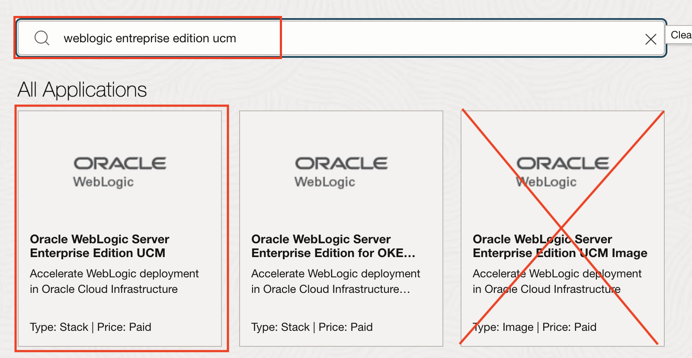
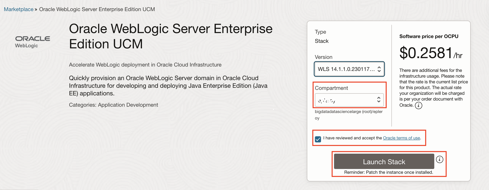
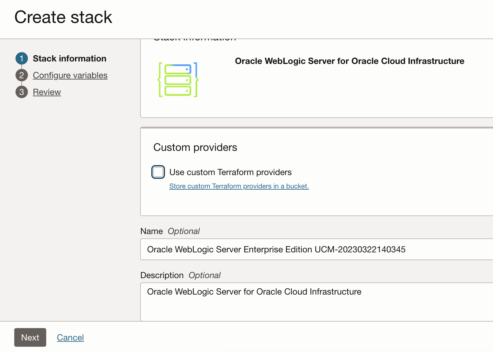
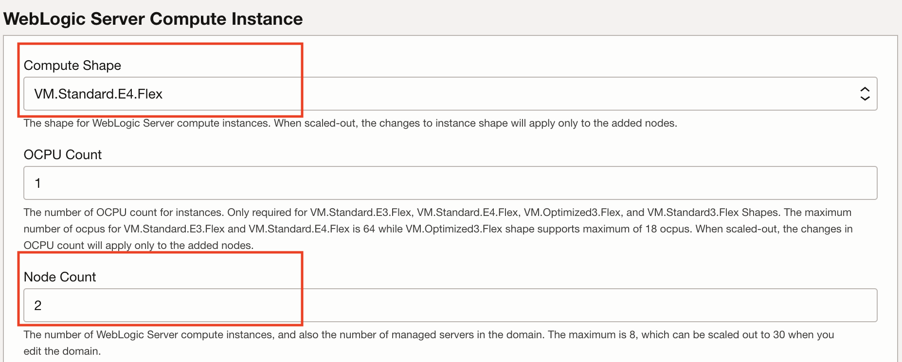
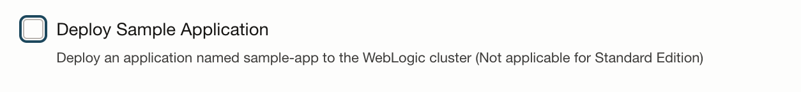
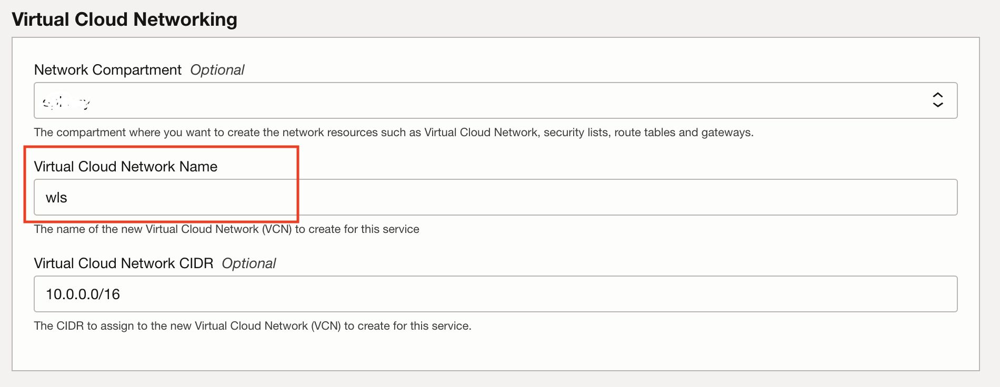
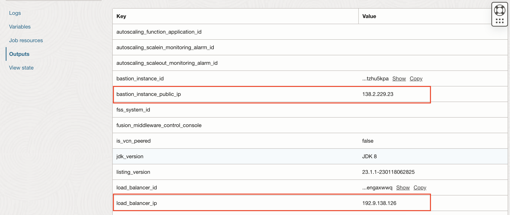

# Provision WebLogic on Oracle Cloud Infrastructure

## Introduction

We will walk you through provisioning the WebLogic infrastructure by leveraging the OCI marketplace image.

Estimated Completion Time: 20 minutes.

### Objectives

- Provision WebLogic Server on Oracle Cloud Infrastructure (WLS on OCI) via the marketplace offering.
- Gather information for further steps.

### Prerequisites

Prepared OCI tenancy with:

- A Vault.
- A Key.
- A Secret for the WebLogic Admin password.

## Task 1: Provision the Stack through the Marketplace

1. Go to **Solutions and Platforms -> Marketplace -> Applications**.

  

2. In the search input, type `weblogic`. Here, we'll use the **Oracle WebLogic Server Enterprise Edition UCM**.

   

3. Make sure you are in the **Compartment** you want to use, use the **default WebLogic version** available, accept the License agreement and click **Launch the Stack**.

   

4. Name the stack and click **Next**.

   

5. Enter a **Resource Name Prefix**.

  It will be used to prefix the name of all the resources (domain, managed servers, admin server, cluster, machines...).

  The next steps in this workshop assumes the resource name prefix is `nonjrf`, so it is highly recommended to use this name.

  

6. Select a **Shape**.

   In a real world situation, choose a shape appropriate to handle the load of a single managed server. Since we're using a trial account, choose the **VM.Standard.E2.1** shape, the **VM.Standard.E2.2** shape or a suitable shape that is available in your tenancy.

  

   To check shape availability, you can go to **Governance -> Limits and Quotas** in another tab, and verify you have a specific shape available.

7. Provision an **SSH key**

   To connect to the WebLogic servers via SSH, you need to provide a public key the server will use to identify your computer.

   *Since the various commands will be ran from inside the on-premises environment (either the workshop compute instance or the local docker containers), you will need to provide the key generated in the on-premises environment.*

  

   To output the public key information, use the following command from inside the on-premises environment as the `oracle` user.
    ```
    <copy>
    cat ~/.ssh/id_rsa.pub
    </copy>
    ```
    Copy the output of the command (the whole multi-line output) and paste it in the form field for SSH key in the form

    the output will look something like this:

    ```bash
    ssh-rsa AAAAB3NzaC1yc2EAAAADAQABAAABAQDlkF23qLyfimJ9Vp4D9psp7bDOB8JvtY/pfYzFxIA2E4v6or+XhvMW5RDhX9Ba54zQNNDLvwUhStdXKkiMXJtEQJarFn45pGy/lyUQKFJolAdHBrXJsg5XWn4DxCFeQUQe1szVfmwDLAktAS14r5g76h3CcA8Kk/cNVqevxVChyejuuOdtAMoriIC8uKV+535qPs/GMiu0zR9aW4w1VodL5eHnXjqdgp8Fr21dVUVQ6of+s/ws0zlQUwghrNguDUqlggzG2mpLBHExypxCrJYmsb05uYjjqVlC3YCatj4nJTIHKLCFiYVY/b8AFkqwXV9EYlja5bjTmunM847dcR8H oracle@ad753161734c
    ```

    **Note:** Do not use the example above as the key: it is a different public key which is useless without the corresponding private key, and you will not be able to access your resources on OCI).

8. Select a **Node count**. Here, we'll provision 2 nodes.

  

9. We'll keep the **WebLogic Server Admin User Name** as the default of `weblogic`.

  

10. Paste the **OCID** of the **Secret** generated previously for the **Secret OCID for WebLogic Admin Password**.

  

11. Check the checkbox for **WebLogic Server Advanced Server Configuration**
   Here you can see all the default ports, which we will keep as-is.

  

12. In this same **Advanced** section, **uncheck** the checkbox to **Provision the Sample Application**: since we will migrate our domain, we want a clean domain to start from.

  

13. In the **WebLogic Network** section, make sure you are in the proper compartment.

  

14. Select **Create New VCN**.

  

15. Name the VCN `wls`.

  

16. **Keep the default** VCN CIDR block as-is.

  

  If you were to migrate from an on-premises domain connected via VPN or FastConnect, you would want to make sure the CIDR block does not conflict with the local network.

17. We'll provision WebLogic in a Private Subnet: admin and managed servers will not be accessible directly from the internet. The admin server will be accessible through a bastion host, and the managed servers will only be accessible through a Public Load Balancer (this is the most likely production scenario, but involves extra complexity in setting up tunnels and resources. + 15 minutes).

    - Select a **Bastion Host Shape**.

    


19. Check the **Provision Load Balancer** checkbox and keep the defaults.

  

  Keep the option for **Private Load Balancer** **Unchecked**.

20. Keep IDCS **unchecked**.

  

21. Keep Policies **checked** unless you are not an admin. In that case you must have created the Dynamic Group and associated the proper rules in the 'Prepare' section.

  

22. Make sure **Provision with JRF** is **not** selected.

  

23. Optionally add Tags.

  

24. Click **Next**.

  

25. Click **Create**.

  

26. The stack will get provisioned using the **Resource Manager**. This may take 7 to 15minutes.

  

Once the stack is provisioned, you can find the information regarding the URL and IP of the WebLogic Admin server in the logs, or in the **Outputs** left-side menu.

## Task 2: Gather Deployment Information and Check WebLogic Status

1. Go to **Outputs** (or you can find the same information at the bottom of the logs).

- *As you provisioned in a **Private Subnet***, you should see something like the following:

  

    - Make a note of the **WebLogic Admin Server Private IP address** from the **WebLogic Admin Server Console URL** for later use.

    - Make a note of the **Load Balancer IP** for later use.

    - Make a note of the Bastion Instance **Public IP address** for later use.

  To access the WebLogic Admin console, you will need to create a tunnel through the bastion host to your local machine.

- *If you used Docker*, open a new terminal session on your local machine, in the `weblogic-to-oci` folder, and export the following local variables (On Windows, use Putty for tunneling):

    ```bash
    <copy>
    export BASTION_IP=<BASTION PUBLIC IP>
    export RHOST=<ADMIN SERVER PRIVATE IP, usually 10.0.3.2>
    export PORT=7002
    </copy>
    ```
    Then use the following command to create a tunnel from the WLS admin server to your local machine.
    ```bash
    <copy>
    ssh -i ./ssh/id_rsa -4 -M -S socket -fnNT -L ${PORT}:${RHOST}:${PORT} opc@${BASTION_IP} cat -
    </copy>
    ```
    Note: the identity key (`-i`) is the key generated inside the Docker container, which is exported locally in the `ssh` folder.

    You can then reach the Admin console in your Firefox browser at [https://localhost:7002/console](https://localhost:7002/console). Make sure you use the `https://` scheme to access as the WLS on OCI admin server uses SSL. You'll be prompted with the SSL self-signed certificate warning.

    You can explore the provisioned WebLogic domain. You should find that there are no applications in **Deployments** and no data sources in the **Service -> Datasources** menu.

- *If you used the marketplace demo image*, export the local variables:

    ```bash
    <copy>
    export BASTION_IP=<BASTION PUBLIC IP>
    </copy>
    ```
    ```bash
    <copy>
    export RHOST=<ADMIN SERVER PRIVATE IP, usually 10.0.3.2>
    </copy>
    ```
    ```bash
    <copy>
    export PORT=7002
    </copy>
    ```
    Then

    We'll need to open up the firewall port 7002 on our demo enviroment with:

    ```bash
    <copy>
    sudo firewall-cmd --permanent --zone=public --add-port=7002/tcp
    sudo systemctl restart firewalld
    </copy>
    ```

    Then use the following command to create a tunnel from the WLS admin server to the on-premises instance that is publicly accessible.
    ```bash
    <copy>
    ssh -4 -M -S socket -fnNT -L 0.0.0.0:${PORT}:${RHOST}:${PORT} opc@${BASTION_IP} cat -
    </copy>
    ```
    In this case we use the default ssh key created on that host and we bind the port to 0.0.0.0 so it is accessible outside.

    You can then access the weblogic console provisioned on OCI on port 7002 on your on-premises Public IP address. Make sure you use *Firefox* and go to `https://IP_OF_DEMO_INSTANCE:7002/console` with `https://` scheme to access as the WLS on OCI admin server uses SSL.

    You'll be prompted with the SSL self-signed certificate warning: click **Advanced** then **Accept the risk and continue**.

While the WebLogic instances are provisioning, it's possible to move forward with the application database provisioning as soon as the VCN is provisioned.

## Acknowledgements

 - **Author** - Emmanuel Leroy, May 2020
 - **Last Updated By/Date** - Emmanuel Leroy, October 2021
