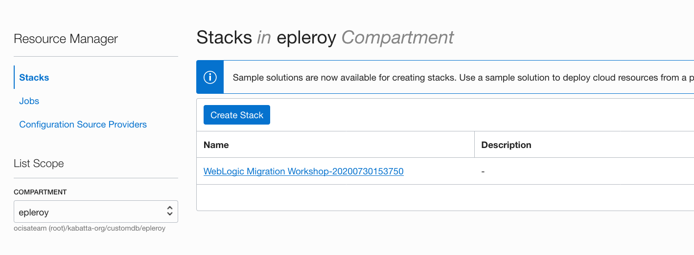
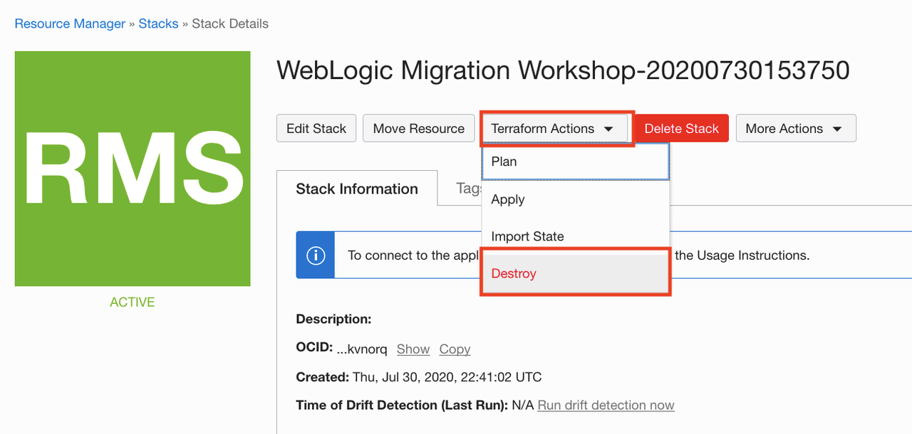
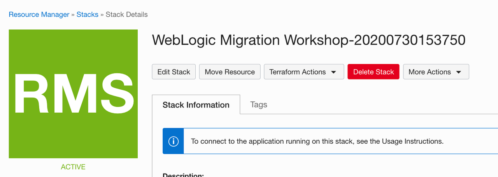

# Tear down the workshop environment

## Introduction

Congratulations! You've come so far and completed the workshop, and you might wonder how to clean up resources.

Estimated Completion Time: 15 minutes

*You should not keep the instances deployed on OCI as part of this workshop running once your are done, or use in any way for actual workloads: since the DB and WebLogic credentials are publically available it would be a security issue.*

### Objectives

- Tear down the infrastructure provisioned.

## Task 1: Cleaning up the on-premises environment

### If you used Docker

Stop the services and remove containers:

```
<copy>
bash
docker-compose down
</copy>
```

> **Note:** The ssh folder with the ssh key pair will remain locally. Key the ssh key pair securely if you intend to access the environment after destroying the demo environment.

### If you used the workshop image from the Oracle Cloud Marketplace

*If you intend on accessing the environment deployed after destroying the demo environment, you must extract the SSH key pair that was created inside the demo VM, or you will lose SSH access to the OCI environment.*

To destroy the demo VM:

1. Go to **Resources Manager**.

2. Select the **compartment** where you deployed the stack originally.

3. Click the stack name for the **Workshop on-premises environment**.

   

4. In **Terraform Actions**, click **Destroy**.

   

5. Once the job completed, click **stack details** in the bread-crumbs menu to get back to the stack details.

6. Click **Delete Stack**.

   

## Task 2: Tear down the Application Database on OCI

1. Go to the **Bare Metal, VM and Exadata Menu**.

2. Click the **Database System** to terminate.

3. Click **More Actions** and **Terminate**.

    You'll be prompted for the name of the DB system to terminate.

    This will take several minutes.

4. On the **Networking** menu, click **Virtual Cloud Networks**.

5. Go to the **Private Subnet** `nonjrf_db_subnet`.

6. Select the `nonjrf-db-security-list` in the list of security lists and click the far-right 3 dots icon to open further options and click **Remove**.

7. Go to **Security Lists**.

8. Select the `nonjrf-db-security-list` Security List and click **Terminate**.

9. Click **Subnets**.

10. Select the private subnet that was created manually `nonjrf_db_subnet`.

11. Click **Terminate**.

> **Note:** You won't be able to proceed until the DB System itself has been terminated.

## Task 3: Tear down the WebLogic environment

You need to terminate the DB subnet before you can tear down the WebLogic deployment as Resource Manager will not be able to clean up the VCN until the DB subnet is removed.

1. Go to the **Resources Manager**.

2. Click the stack name for the **WebLogic Server deployment**.

3. In **Terraform Actions**, click **Destroy**.

   

4. Once the job completed, click **stack details** in the bread-crumbs menu to get back to the stack details.

5. Click **Delete Stack**.

   

## Acknowledgements

 - **Author** - Emmanuel Leroy, May 2020
 - **Last Updated By/Date** - Emmanuel Leroy, March 2023
